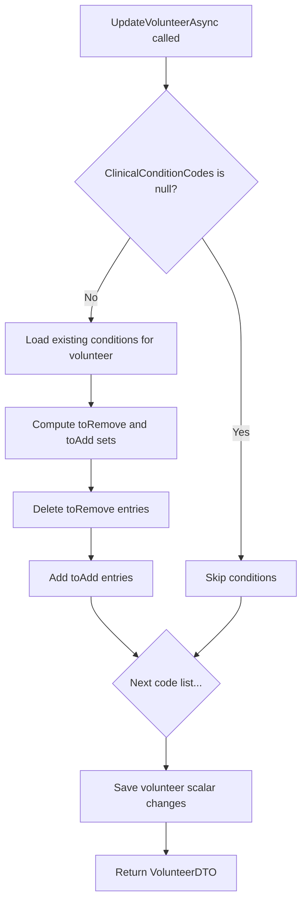
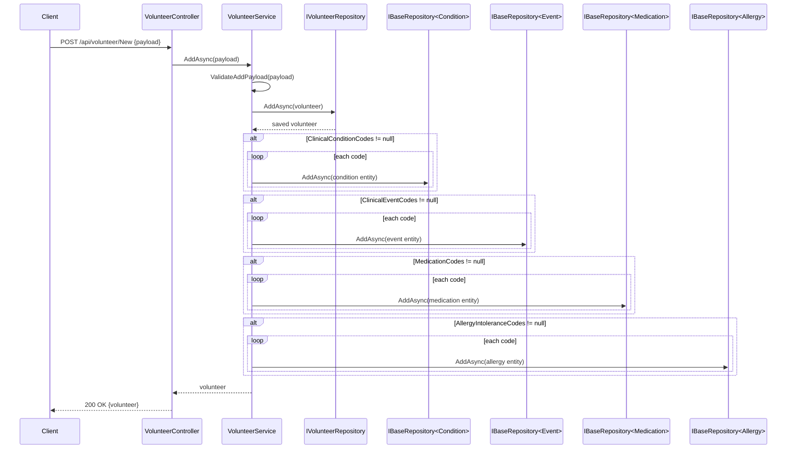
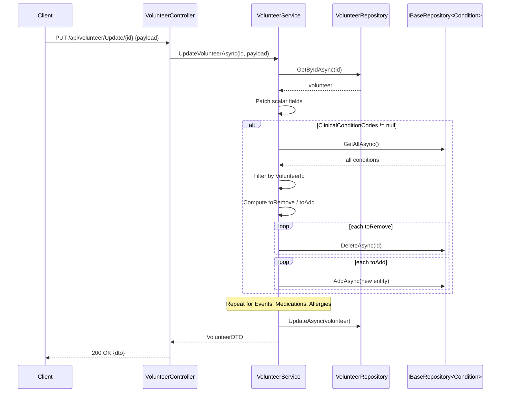

# Architecture: Volunteer-Clinical Entity Relationship Fix

## Problem Summary

Volunteer clinical sub-entities (conditions, events, medications, allergies) are never persisted through the API. The join tables `volunteer_clinical_conditions`, `volunteer_clinical_events`, `volunteer_medications`, and `volunteer_allergy_intolerances` remain empty despite their SNOMED catalog counterparts containing data.

Three bugs contribute to this: missing DI registrations for generic repositories, no API surface to manage clinical data on volunteers, and a missing `.Include(v => v.ClinicalEvents)` in sync export.

## Design Decision: Inline on Volunteer Payloads

Rather than creating separate controller endpoints for each clinical sub-entity (which would require 8+ new endpoints and a new controller), the fix embeds clinical SNOMED codes directly in the existing `AddVolunteerPayload` and `UpdateVolunteerPayload`. The `VolunteerService.AddAsync` and `UpdateVolunteerAsync` methods become responsible for mapping codes to join-table entities and persisting them in the same transaction as the volunteer.

This keeps the API surface minimal and matches how the mobile app submits data: a single volunteer form with clinical checkboxes.

## Architectural Changes

### 1. Payload Extensions

Both payloads receive four new `List<string>?` properties carrying SNOMED codes:

```csharp
// Added to AddVolunteerPayload and UpdateVolunteerPayload
public List<string>? ClinicalConditionCodes { get; set; }
public List<string>? ClinicalEventCodes { get; set; }
public List<string>? MedicationCodes { get; set; }
public List<string>? AllergyIntoleranceCodes { get; set; }
```

Each list is nullable. When `null`, the service ignores that clinical category (no-op). When present (even if empty), the service applies the merge strategy described below.

### 2. DI Registrations (NativeInjectorBootStrapper)

Four generic `BaseRepository` registrations are added to `RegisterRepositories()`:

```csharp
services.AddScoped<IBaseRepository<VolunteerClinicalCondition, Guid>, BaseRepository<VolunteerClinicalCondition, Guid>>();
services.AddScoped<IBaseRepository<VolunteerClinicalEvent, Guid>, BaseRepository<VolunteerClinicalEvent, Guid>>();
services.AddScoped<IBaseRepository<VolunteerMedication, Guid>, BaseRepository<VolunteerMedication, Guid>>();
services.AddScoped<IBaseRepository<VolunteerAllergyIntolerance, Guid>, BaseRepository<VolunteerAllergyIntolerance, Guid>>();
```

`BaseRepository<T, Guid>` constructor takes `DbContext` (resolved as `PrismDbContext`) and `IApiContext`, both already registered. No new repository interfaces or implementations are needed.

### 3. VolunteerService Changes

#### Constructor

Inject the four `IBaseRepository` instances alongside the existing `IVolunteerRepository`:

```csharp
public VolunteerService(
    IVolunteerRepository repository,
    IApiContext apiContext,
    IBaseRepository<VolunteerClinicalCondition, Guid> conditionRepo,
    IBaseRepository<VolunteerClinicalEvent, Guid> eventRepo,
    IBaseRepository<VolunteerMedication, Guid> medicationRepo,
    IBaseRepository<VolunteerAllergyIntolerance, Guid> allergyRepo
) : base(repository, apiContext) { ... }
```

#### AddAsync Flow

After creating the `Volunteer` entity and calling `_volunteerRepository.AddAsync(volunteer)`, the service iterates each non-null code list and creates corresponding join-table entities:

```
AddAsync(payload)
  1. Validate payload (existing logic)
  2. Create Volunteer entity
  3. Save Volunteer via _volunteerRepository.AddAsync
  4. For each non-null code list:
     - ClinicalConditionCodes -> create VolunteerClinicalCondition per code
     - ClinicalEventCodes    -> create VolunteerClinicalEvent per code
     - MedicationCodes       -> create VolunteerMedication per code
     - AllergyIntoleranceCodes -> create VolunteerAllergyIntolerance per code
  5. Save each entity via the corresponding IBaseRepository.AddAsync
  6. Return Volunteer
```

Default values for required fields on join entities:

| Entity | Field | Default |
|--------|-------|---------|
| `VolunteerClinicalCondition` | `ClinicalStatus` | `"Active"` |
| `VolunteerClinicalCondition` | `VerificationStatus` | `"Unconfirmed"` |
| `VolunteerClinicalEvent` | `EventType` | `"finding"` |
| `VolunteerClinicalEvent` | `EventDatetime` | `DateTime.UtcNow` |
| `VolunteerMedication` | `Status` | `"Active"` |
| `VolunteerMedication` | `StartDate` | `DateTime.UtcNow` |
| `VolunteerAllergyIntolerance` | `ClinicalStatus` | `"Active"` |
| `VolunteerAllergyIntolerance` | `Criticality` | `"unable-to-assess"` |
| `VolunteerAllergyIntolerance` | `VerificationStatus` | `"Unconfirmed"` |
| All | `RecordedBy` | `Guid.Empty` |
| All | `CreatedAt`, `UpdatedAt` | `DateTime.UtcNow` |

#### UpdateAsync Flow -- Merge Strategy

On update, the service implements a **merge** (set-reconciliation) strategy: the incoming code list is the desired state. Codes present in the DB but absent from the payload are removed; codes present in the payload but absent from the DB are added; existing matches are left untouched.

```
UpdateVolunteerAsync(id, payload)
  1. Load volunteer (existing logic)
  2. Patch scalar fields (existing logic)
  3. For each non-null code list:
     a. Fetch existing join entities for this volunteer via repo.GetAllAsync()
        filtered by VolunteerId
     b. Compute:
        - toRemove = existing codes NOT in payload list
        - toAdd    = payload codes NOT in existing set
     c. Delete each toRemove entity via repo.DeleteAsync(entity.Id)
     d. Create + AddAsync each toAdd entity (same defaults as AddAsync)
  4. Save volunteer via _volunteerRepository.UpdateAsync
  5. Return VolunteerDTO
```

When a code list property is `null`, that category is skipped entirely (no merge, no deletion). An explicitly empty list (`[]`) means "remove all entries for this category."



### 4. SyncExportService Fix

Add the missing `.Include(v => v.ClinicalEvents)` in `GetVolunteersAsync()`:

```csharp
var query = _context.Volunteers
    .AsNoTracking()
    .Include(v => v.VitalSigns)
    .Include(v => v.ClinicalConditions)
    .Include(v => v.ClinicalEvents)        // <-- added
    .Include(v => v.Medications)
    .Include(v => v.AllergyIntolerances)
    .AsQueryable();
```

### 5. No Controller Changes Required

The existing `VolunteerController.New()` and `VolunteerController.Update()` endpoints already deserialize `AddVolunteerPayload` / `UpdateVolunteerPayload` from `HttpContext.Items["DecryptedRequest"]` and pass them to the service. Since we only add nullable properties to the payloads, existing callers that omit the new fields will get `null` (no-op), preserving backward compatibility.

## File Change Matrix

| File | Change Type | Description |
|------|-------------|-------------|
| `Bioteca.Prism.Domain/Payloads/Volunteer/AddVolunteerPayload.cs` | Modify | Add 4 nullable `List<string>` properties |
| `Bioteca.Prism.Domain/Payloads/Volunteer/UpdateVolunteerPayload.cs` | Modify | Add 4 nullable `List<string>` properties |
| `Bioteca.Prism.CrossCutting/NativeInjectorBootStrapper.cs` | Modify | Add 4 `IBaseRepository<T,Guid>` registrations |
| `Bioteca.Prism.Service/Services/Volunteer/VolunteerService.cs` | Modify | Inject repos, add clinical persistence in AddAsync/UpdateAsync |
| `Bioteca.Prism.Service/Interfaces/Volunteer/IVolunteerService.cs` | No change | Signatures unchanged |
| `Bioteca.Prism.Service/Services/Sync/SyncExportService.cs` | Modify | Add `.Include(v => v.ClinicalEvents)` |
| `Bioteca.Prism.InteroperableResearchNode/Controllers/VolunteerController.cs` | No change | Payloads are backward-compatible |

## SNOMED Code Matching

Each join entity uses a SNOMED code as FK to its catalog table:

| Join Entity | FK Property | Catalog Table |
|-------------|-------------|---------------|
| `VolunteerClinicalCondition` | `SnomedCode` | `clinical_conditions` |
| `VolunteerClinicalEvent` | `SnomedCode` | `clinical_events` |
| `VolunteerMedication` | `MedicationSnomedCode` | `medications` |
| `VolunteerAllergyIntolerance` | `AllergyIntoleranceSnomedCode` | `allergy_intolerances` |

The service trusts that incoming codes exist in the catalog (database FK constraint will reject invalid codes). No explicit validation query is performed -- EF Core will throw on `SaveChanges` if a code is invalid, and the controller's catch block will return a 500 error.

## Sequence Diagram: Add Volunteer with Clinical Data



## Sequence Diagram: Update Volunteer (Merge)



## Backward Compatibility

All four new payload properties are nullable (`List<string>?`). Existing API consumers that do not send these fields will cause the JSON deserializer to leave them as `null`. The service interprets `null` as "do not touch this category," so existing behavior is fully preserved.

An empty list (`[]`) explicitly means "clear all entries for this category," which is the correct semantic for the merge strategy.

## Existing VolunteerClinicalService

The existing `IVolunteerClinicalService` / `VolunteerClinicalService` remain untouched. They provide read-only query methods (get conditions/events/medications/allergies for a volunteer, get clinical summary) that can be exposed via separate endpoints in the future. The write path now goes through `VolunteerService` as designed.

## Implementation Order

1. **DI registrations** in `NativeInjectorBootStrapper` (unblocks everything)
2. **Payload extensions** (add code list properties)
3. **VolunteerService.AddAsync** (create sub-entities)
4. **VolunteerService.UpdateVolunteerAsync** (merge sub-entities)
5. **SyncExportService** (add missing include)
6. **Testing** (unit + integration)
