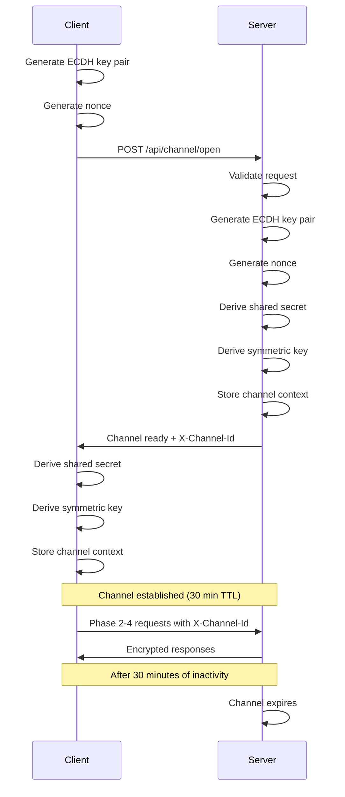

# Phase 1: Encrypted Channel Establishment

Phase 1 establishes a secure, encrypted communication channel between nodes using ECDH P-384 key exchange and AES-256-GCM encryption. This phase provides Perfect Forward Secrecy through ephemeral keys.

## Overview

**Purpose**: Create an encrypted channel for all subsequent communication
**Security**: ECDH P-384 + AES-256-GCM + HKDF-SHA256
**Duration**: Channels expire after 30 minutes of inactivity
**Result**: `X-Channel-Id` header for use in Phases 2-4

## Endpoints

### POST /api/channel/open

Establishes an encrypted channel when acting as the server (receiving connection).

#### Request

**Headers**:
```http
Content-Type: application/json
```

**Body**:
```json
{
  "protocolVersion": "1.0",
  "ephemeralPublicKey": "base64-encoded-P384-public-key",
  "keyExchangeAlgorithm": "ECDH-P384",
  "supportedCiphers": ["AES-256-GCM", "ChaCha20-Poly1305"],
  "nonce": "base64-encoded-random-nonce",
  "timestamp": "2025-10-23T10:00:00Z"
}
```

**Field Descriptions**:
- `protocolVersion`: Must be "1.0" (current version)
- `ephemeralPublicKey`: Client's ECDH P-384 public key (Base64)
- `keyExchangeAlgorithm`: Must be "ECDH-P384"
- `supportedCiphers`: Array of supported encryption algorithms
- `nonce`: Random nonce (minimum 12 bytes, Base64)
- `timestamp`: Current UTC timestamp (±5 minutes tolerance)

#### Response

**Status**: 200 OK

**Headers**:
```http
X-Channel-Id: a1b2c3d4-e5f6-4789-a1b2-c3d4e5f67890
Content-Type: application/json
```

**Body**:
```json
{
  "protocolVersion": "1.0",
  "ephemeralPublicKey": "base64-encoded-server-public-key",
  "keyExchangeAlgorithm": "ECDH-P384",
  "selectedCipher": "AES-256-GCM",
  "timestamp": "2025-10-23T10:00:01Z",
  "nonce": "base64-encoded-server-nonce"
}
```

#### Error Responses

**400 Bad Request** - Invalid request
```json
{
  "error": {
    "code": "ERR_INCOMPATIBLE_VERSION",
    "message": "Unsupported protocol version",
    "details": {
      "clientVersion": "2.0",
      "serverVersion": "1.0"
    },
    "retryable": false
  }
}
```

**400 Bad Request** - No compatible cipher
```json
{
  "error": {
    "code": "ERR_CHANNEL_FAILED",
    "message": "No compatible cipher found",
    "details": {
      "clientCiphers": ["ChaCha20-Poly1305"],
      "serverCiphers": ["AES-256-GCM"]
    },
    "retryable": false
  }
}
```

**400 Bad Request** - Invalid timestamp
```json
{
  "error": {
    "code": "ERR_INVALID_TIMESTAMP",
    "message": "Timestamp is too old (possible replay attack)",
    "details": {
      "clientTimestamp": "2025-10-23T09:54:00Z",
      "serverTimestamp": "2025-10-23T10:00:00Z",
      "maxAgeMinutes": 5
    },
    "retryable": true
  }
}
```

#### curl Example

```bash
# Generate ephemeral key pair (using OpenSSL)
openssl ecparam -name secp384r1 -genkey -noout -out client_key.pem
openssl ec -in client_key.pem -pubout -out client_pub.pem

# Extract public key in base64
CLIENT_PUB_KEY=$(openssl ec -pubin -in client_pub.pem -outform DER | base64 -w 0)

# Generate nonce
NONCE=$(openssl rand -base64 16)

# Open channel
curl -X POST http://localhost:5000/api/channel/open \
  -H "Content-Type: application/json" \
  -d "{
    \"protocolVersion\": \"1.0\",
    \"ephemeralPublicKey\": \"$CLIENT_PUB_KEY\",
    \"keyExchangeAlgorithm\": \"ECDH-P384\",
    \"supportedCiphers\": [\"AES-256-GCM\"],
    \"nonce\": \"$NONCE\",
    \"timestamp\": \"$(date -u +%Y-%m-%dT%H:%M:%SZ)\"
  }" \
  -i  # Include headers in output to see X-Channel-Id
```

#### C# Client Example

```csharp
using System.Security.Cryptography;
using System.Text.Json;

public async Task<ChannelReadyResponse> OpenChannelAsync(string nodeUrl)
{
    // Generate ephemeral key pair
    using var ecdh = ECDiffieHellman.Create(ECCurve.NamedCurves.nistP384);
    var publicKey = Convert.ToBase64String(ecdh.ExportSubjectPublicKeyInfo());

    // Generate nonce
    var nonce = new byte[16];
    RandomNumberGenerator.Fill(nonce);

    var request = new ChannelOpenRequest
    {
        ProtocolVersion = "1.0",
        EphemeralPublicKey = publicKey,
        KeyExchangeAlgorithm = "ECDH-P384",
        SupportedCiphers = new[] { "AES-256-GCM" },
        Nonce = Convert.ToBase64String(nonce),
        Timestamp = DateTime.UtcNow
    };

    var response = await httpClient.PostAsJsonAsync(
        $"{nodeUrl}/api/channel/open",
        request
    );

    // Extract channel ID from header
    var channelId = response.Headers.GetValues("X-Channel-Id").FirstOrDefault();

    var responseBody = await response.Content.ReadFromJsonAsync<ChannelReadyResponse>();

    // Derive shared secret and symmetric key...
    // (Key derivation code omitted for brevity)

    return responseBody;
}
```

---

### POST /api/channel/initiate

Initiates a handshake with a remote node (acting as client).

#### Request

**Headers**:
```http
Content-Type: application/json
```

**Body**:
```json
{
  "remoteNodeUrl": "http://localhost:5001"
}
```

#### Response

**Status**: 200 OK

**Body**:
```json
{
  "success": true,
  "channelId": "a1b2c3d4-e5f6-4789-a1b2-c3d4e5f67890",
  "selectedCipher": "AES-256-GCM",
  "remoteNodeUrl": "http://localhost:5001",
  "createdAt": "2025-10-23T10:00:00Z",
  "expiresAt": "2025-10-23T10:30:00Z",
  "message": "Channel established successfully"
}
```

#### Error Response

**400 Bad Request**
```json
{
  "error": {
    "code": "ERR_INVALID_REQUEST",
    "message": "Remote node URL is required",
    "retryable": false
  }
}
```

#### curl Example

```bash
curl -X POST http://localhost:5000/api/channel/initiate \
  -H "Content-Type: application/json" \
  -d '{"remoteNodeUrl": "http://localhost:5001"}'
```

---

### GET /api/channel/{channelId}

Gets information about an established channel (for debugging/monitoring).

#### Request

**Headers**: None required

**Parameters**:
- `channelId` (path): The channel identifier

#### Response

**Status**: 200 OK

**Body**:
```json
{
  "channelId": "a1b2c3d4-e5f6-4789-a1b2-c3d4e5f67890",
  "cipher": "AES-256-GCM",
  "remoteNodeUrl": "http://localhost:5001",
  "createdAt": "2025-10-23T10:00:00Z",
  "expiresAt": "2025-10-23T10:30:00Z",
  "isExpired": false,
  "role": "server"
}
```

**Status**: 404 Not Found - Channel not found

#### curl Example

```bash
curl -X GET http://localhost:5000/api/channel/a1b2c3d4-e5f6-4789-a1b2-c3d4e5f67890
```

---

### GET /api/channel/health

Health check endpoint for monitoring.

#### Request

**Headers**: None required

#### Response

**Status**: 200 OK

**Body**:
```json
{
  "status": "healthy",
  "timestamp": "2025-10-23T10:00:00Z"
}
```

#### curl Example

```bash
curl -X GET http://localhost:5000/api/channel/health
```

---

## Key Derivation Process

The symmetric key for channel encryption is derived using:

1. **Shared Secret**: Computed via ECDH P-384
2. **Salt**: Concatenation of client nonce + server nonce
3. **Info**: ASCII bytes of "IRN-Channel-v1.0"
4. **HKDF**: HKDF-SHA256 to derive 256-bit key

```
symmetricKey = HKDF-SHA256(
    IKM = sharedSecret,
    salt = clientNonce || serverNonce,
    info = "IRN-Channel-v1.0",
    L = 32 bytes
)
```

## Security Considerations

1. **Ephemeral Keys**: Keys are generated per session and never reused
2. **Perfect Forward Secrecy**: Compromise of long-term keys doesn't affect past sessions
3. **Timestamp Validation**: ±5 minute window prevents replay attacks
4. **Nonce Requirements**: Minimum 12 bytes of randomness
5. **Channel Expiration**: 30-minute timeout for inactive channels
6. **Key Cleanup**: Ephemeral keys are securely disposed after use

## Channel Lifecycle



## Testing

### Complete Channel Establishment Test

```bash
#!/bin/bash
# test-phase1.sh

NODE_A="http://localhost:5000"
NODE_B="http://localhost:5001"

echo "Testing Phase 1: Channel Establishment"
echo "======================================="

# Test health check
echo -e "\n1. Testing health check..."
curl -s $NODE_A/api/channel/health | jq '.'

# Test channel opening
echo -e "\n2. Opening channel from Node A to Node B..."
RESPONSE=$(curl -s -X POST $NODE_A/api/channel/initiate \
  -H "Content-Type: application/json" \
  -d "{\"remoteNodeUrl\": \"$NODE_B\"}")

CHANNEL_ID=$(echo $RESPONSE | jq -r '.channelId')
echo "Channel established: $CHANNEL_ID"

# Verify channel
echo -e "\n3. Verifying channel..."
curl -s $NODE_A/api/channel/$CHANNEL_ID | jq '.'

echo -e "\nPhase 1 test complete!"
```

## Common Issues

### Issue: "ERR_INVALID_EPHEMERAL_KEY"
**Cause**: Malformed or invalid ECDH public key
**Solution**: Ensure proper P-384 curve point encoding in Base64

### Issue: "ERR_INVALID_TIMESTAMP"
**Cause**: Clock skew between client and server
**Solution**: Synchronize system clocks (NTP)

### Issue: "ERR_CHANNEL_FAILED"
**Cause**: No compatible cipher suites
**Solution**: Ensure at least "AES-256-GCM" is supported

## Next Steps

After successful channel establishment:
1. Store the `X-Channel-Id` from response header
2. Use this channel ID for all Phase 2-4 requests
3. Proceed to [Phase 2: Node Identification](phase2-identification.md)

---

**Related Documentation**:
- [Phase 2: Node Identification](phase2-identification.md)
- [Security Overview](../SECURITY_OVERVIEW.md)
- [Channel Flow Workflow](../workflows/CHANNEL_FLOW.md)