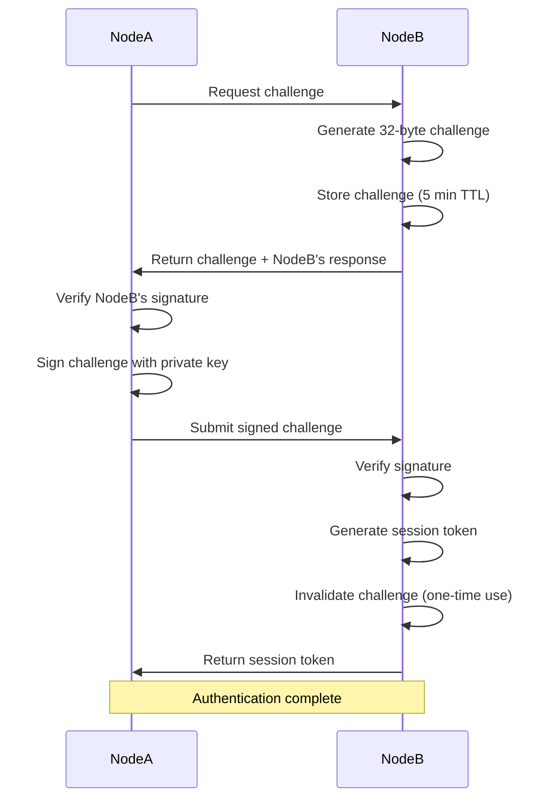

# Phase 3: Mutual Authentication

Phase 3 implements a challenge-response protocol for mutual authentication between nodes. Both nodes prove possession of their private keys through RSA-2048 signature verification.

## Overview

**Purpose**: Mutual authentication via challenge-response protocol
**Security**: RSA-2048 signatures + 32-byte random challenges
**Prerequisites**:
- Completed Phase 1 (encrypted channel)
- Completed Phase 2 (node identified as `Authorized`)
**Result**: Session token for Phase 4 operations

## Authentication Flow



## Endpoints

### POST /api/node/challenge

Requests an authentication challenge from the remote node.

#### Request

**Headers**:
```http
X-Channel-Id: {channelId}
Content-Type: application/json
```

**Body** (encrypted via channel):
```json
{
  "nodeId": "node-a",
  "timestamp": "2025-10-23T10:00:00Z"
}
```

**Field Descriptions**:
- `nodeId`: Identifier of the requesting node
- `timestamp`: Current UTC timestamp

#### Response

**Status**: 200 OK

**Body** (encrypted via channel):
```json
{
  "challenge": "base64-encoded-32-byte-random-challenge",
  "serverChallenge": "base64-encoded-32-byte-server-challenge",
  "serverSignature": "base64-encoded-rsa-signature-of-server-challenge",
  "expiresAt": "2025-10-23T10:05:00Z",
  "timestamp": "2025-10-23T10:00:00Z"
}
```

**Field Descriptions**:
- `challenge`: Random challenge for the client to sign
- `serverChallenge`: Server's own challenge (for mutual auth)
- `serverSignature`: Server's signature of its own challenge
- `expiresAt`: Challenge expiration time (5 minutes)
- `timestamp`: Server timestamp

#### Error Responses

**400 Bad Request** - Node not identified
```json
{
  "error": {
    "code": "ERR_NODE_NOT_IDENTIFIED",
    "message": "Node must complete Phase 2 identification before requesting challenge",
    "retryable": false
  }
}
```

**400 Bad Request** - Node not authorized
```json
{
  "error": {
    "code": "ERR_NODE_NOT_AUTHORIZED",
    "message": "Node status is Pending. Only authorized nodes can authenticate.",
    "retryable": false
  }
}
```

#### curl Example

```bash
# Assuming CHANNEL_ID from Phase 1
CHANNEL_ID="a1b2c3d4-e5f6-4789-a1b2-c3d4e5f67890"

# Create challenge request
REQUEST='{
  "nodeId": "node-a",
  "timestamp": "'$(date -u +%Y-%m-%dT%H:%M:%SZ)'"
}'

# Encrypt and send (simplified - actual encryption via AES-256-GCM)
curl -X POST http://localhost:5000/api/node/challenge \
  -H "X-Channel-Id: $CHANNEL_ID" \
  -H "Content-Type: application/json" \
  -d "$REQUEST"
```

#### C# Client Example

```csharp
public async Task<ChallengeResponse> RequestChallengeAsync(
    string channelId,
    byte[] symmetricKey,
    string nodeId)
{
    var request = new ChallengeRequest
    {
        NodeId = nodeId,
        Timestamp = DateTime.UtcNow
    };

    // Encrypt request
    var encryptedPayload = EncryptPayload(request, symmetricKey);

    var httpRequest = new HttpRequestMessage(HttpMethod.Post, "/api/node/challenge");
    httpRequest.Headers.Add("X-Channel-Id", channelId);
    httpRequest.Content = JsonContent.Create(encryptedPayload);

    var response = await httpClient.SendAsync(httpRequest);

    // Decrypt response
    var encryptedResponse = await response.Content.ReadFromJsonAsync<EncryptedPayload>();
    var challengeResponse = DecryptPayload<ChallengeResponse>(encryptedResponse, symmetricKey);

    // Verify server's signature (mutual authentication)
    var serverCert = GetServerCertificate(); // Retrieved during Phase 2
    var isValid = VerifySignature(
        challengeResponse.ServerChallenge,
        challengeResponse.ServerSignature,
        serverCert
    );

    if (!isValid)
    {
        throw new SecurityException("Server signature verification failed");
    }

    return challengeResponse;
}
```

---

### POST /api/node/authenticate

Submits the signed challenge response to complete authentication.

#### Request

**Headers**:
```http
X-Channel-Id: {channelId}
Content-Type: application/json
```

**Body** (encrypted via channel):
```json
{
  "nodeId": "node-a",
  "challenge": "base64-encoded-challenge-from-server",
  "signature": "base64-encoded-rsa-signature",
  "timestamp": "2025-10-23T10:00:05Z"
}
```

**Field Descriptions**:
- `nodeId`: Identifier of the authenticating node
- `challenge`: The challenge received from `/api/node/challenge`
- `signature`: RSA-2048 signature of the challenge
- `timestamp`: Current UTC timestamp

#### Response

**Status**: 200 OK

**Body** (encrypted via channel):
```json
{
  "success": true,
  "sessionToken": "f7e6d5c4-b3a2-1098-7654-321098765432",
  "nodeId": "node-a",
  "channelId": "a1b2c3d4-e5f6-4789-a1b2-c3d4e5f67890",
  "capabilities": "ReadWrite",
  "expiresAt": "2025-10-23T11:00:00Z",
  "message": "Authentication successful. Session established.",
  "nextPhase": "phase4_session"
}
```

**Field Descriptions**:
- `success`: Authentication result
- `sessionToken`: Token for Phase 4 operations (1-hour TTL)
- `nodeId`: Authenticated node identifier
- `channelId`: Associated channel ID
- `capabilities`: Granted access level
- `expiresAt`: Session expiration time
- `message`: Status message
- `nextPhase`: Next protocol phase

#### Error Responses

**400 Bad Request** - Invalid signature
```json
{
  "error": {
    "code": "ERR_INVALID_CHALLENGE_RESPONSE",
    "message": "Challenge response verification failed",
    "retryable": false
  }
}
```

**400 Bad Request** - Challenge expired
```json
{
  "error": {
    "code": "ERR_CHALLENGE_EXPIRED",
    "message": "Challenge has expired. Request a new challenge.",
    "retryable": true
  }
}
```

**400 Bad Request** - Challenge already used
```json
{
  "error": {
    "code": "ERR_CHALLENGE_USED",
    "message": "Challenge has already been used",
    "retryable": false
  }
}
```

#### curl Example

```bash
# Sign the challenge received from previous step
CHALLENGE="base64-encoded-challenge-from-server"
SIGNATURE=$(echo -n "$CHALLENGE" | base64 -d | openssl dgst -sha256 -sign node-a.key | base64 -w 0)

# Create authentication request
REQUEST='{
  "nodeId": "node-a",
  "challenge": "'$CHALLENGE'",
  "signature": "'$SIGNATURE'",
  "timestamp": "'$(date -u +%Y-%m-%dT%H:%M:%SZ)'"
}'

# Encrypt and send
curl -X POST http://localhost:5000/api/node/authenticate \
  -H "X-Channel-Id: $CHANNEL_ID" \
  -H "Content-Type: application/json" \
  -d "$REQUEST"
```

#### C# Client Example

```csharp
public async Task<AuthenticationResponse> AuthenticateAsync(
    string channelId,
    byte[] symmetricKey,
    string nodeId,
    string challenge,
    RSA privateKey)
{
    // Decode challenge
    var challengeBytes = Convert.FromBase64String(challenge);

    // Sign challenge with private key
    var signature = privateKey.SignData(
        challengeBytes,
        HashAlgorithmName.SHA256,
        RSASignaturePadding.Pkcs1
    );

    var request = new ChallengeResponseRequest
    {
        NodeId = nodeId,
        Challenge = challenge,
        Signature = Convert.ToBase64String(signature),
        Timestamp = DateTime.UtcNow
    };

    // Encrypt request
    var encryptedPayload = EncryptPayload(request, symmetricKey);

    var httpRequest = new HttpRequestMessage(HttpMethod.Post, "/api/node/authenticate");
    httpRequest.Headers.Add("X-Channel-Id", channelId);
    httpRequest.Content = JsonContent.Create(encryptedPayload);

    var response = await httpClient.SendAsync(httpRequest);

    // Decrypt response
    var encryptedResponse = await response.Content.ReadFromJsonAsync<EncryptedPayload>();
    var authResponse = DecryptPayload<AuthenticationResponse>(encryptedResponse, symmetricKey);

    if (authResponse.Success)
    {
        // Store session token for Phase 4
        StoreSessionToken(authResponse.SessionToken);
    }

    return authResponse;
}
```

---

## Challenge Properties

### Challenge Generation
- **Size**: 32 bytes (256 bits) of cryptographic randomness
- **Uniqueness**: Each challenge is unique
- **TTL**: 5 minutes from generation
- **Usage**: One-time use only

### Challenge Storage
```csharp
public class Challenge
{
    public string ChallengeId { get; set; }  // Unique ID
    public string NodeId { get; set; }       // Requesting node
    public byte[] ChallengeData { get; set; } // 32 bytes
    public DateTime CreatedAt { get; set; }
    public DateTime ExpiresAt { get; set; }
    public bool IsUsed { get; set; }
}
```

## Signature Verification

### Signing Process
```csharp
// Create signature
byte[] dataToSign = Convert.FromBase64String(challenge);
byte[] signature = privateKey.SignData(
    dataToSign,
    HashAlgorithmName.SHA256,
    RSASignaturePadding.Pkcs1
);
```

### Verification Process
```csharp
// Verify signature
bool isValid = publicKey.VerifyData(
    challengeBytes,
    signatureBytes,
    HashAlgorithmName.SHA256,
    RSASignaturePadding.Pkcs1
);
```

## Security Considerations

1. **Challenge Entropy**: Use cryptographically secure random generator
2. **Challenge Expiration**: 5-minute TTL prevents replay attacks
3. **One-Time Use**: Challenges are invalidated after use
4. **Mutual Authentication**: Both parties prove key possession
5. **Signature Algorithm**: RSA-2048 with SHA-256
6. **Certificate Validation**: Verify certificate chain in production

## Complete Authentication Flow Example

```csharp
public async Task<string> CompletePhase3AuthenticationAsync(
    string channelId,
    byte[] symmetricKey,
    string nodeId,
    X509Certificate2 certificate,
    RSA privateKey)
{
    // Step 1: Request challenge
    var challengeResponse = await RequestChallengeAsync(
        channelId, symmetricKey, nodeId
    );

    // Step 2: Verify server's signature (mutual auth)
    var serverValid = VerifyServerSignature(
        challengeResponse.ServerChallenge,
        challengeResponse.ServerSignature
    );

    if (!serverValid)
    {
        throw new SecurityException("Server authentication failed");
    }

    // Step 3: Sign and submit challenge
    var authResponse = await AuthenticateAsync(
        channelId,
        symmetricKey,
        nodeId,
        challengeResponse.Challenge,
        privateKey
    );

    if (!authResponse.Success)
    {
        throw new AuthenticationException(authResponse.Message);
    }

    return authResponse.SessionToken;
}
```

## Testing

### Complete Phase 3 Test

```bash
#!/bin/bash
# test-phase3.sh

NODE_A="http://localhost:5000"
CHANNEL_ID="$1"  # Pass channel ID from Phase 1

echo "Testing Phase 3: Mutual Authentication"
echo "======================================"

# 1. Request challenge
echo -e "\n1. Requesting authentication challenge..."
CHALLENGE_RESPONSE=$(curl -s -X POST $NODE_A/api/node/challenge \
  -H "X-Channel-Id: $CHANNEL_ID" \
  -H "Content-Type: application/json" \
  -d '{"nodeId": "node-a", "timestamp": "'$(date -u +%Y-%m-%dT%H:%M:%SZ)'"}')

echo "Challenge received"

# 2. Extract and sign challenge
CHALLENGE=$(echo $CHALLENGE_RESPONSE | jq -r '.challenge')
echo "Challenge: $CHALLENGE"

# 3. Submit authentication
echo -e "\n2. Submitting authentication response..."
AUTH_RESPONSE=$(curl -s -X POST $NODE_A/api/node/authenticate \
  -H "X-Channel-Id: $CHANNEL_ID" \
  -H "Content-Type: application/json" \
  -d '{
    "nodeId": "node-a",
    "challenge": "'$CHALLENGE'",
    "signature": "mock-signature",
    "timestamp": "'$(date -u +%Y-%m-%dT%H:%M:%SZ)'"
  }')

SESSION_TOKEN=$(echo $AUTH_RESPONSE | jq -r '.sessionToken')
echo "Session established: $SESSION_TOKEN"

echo -e "\nPhase 3 test complete!"
echo "Session token for Phase 4: $SESSION_TOKEN"
```

## Common Issues

### Issue: "Challenge response verification failed"
**Cause**: Signature doesn't match certificate
**Solution**: Ensure correct private key and signature algorithm

### Issue: "Challenge has expired"
**Cause**: More than 5 minutes elapsed
**Solution**: Request new challenge immediately before signing

### Issue: "Challenge has already been used"
**Cause**: Attempting to reuse a challenge
**Solution**: Each authentication requires a new challenge

### Issue: "Node must complete Phase 2 identification"
**Cause**: Phase 2 not completed or channel expired
**Solution**: Complete Phase 2 identification first

## Session Token Usage

After successful authentication, the session token is used for Phase 4:

### v0.10.0+ (New Pattern)
```http
X-Channel-Id: {channelId}
X-Session-Id: {sessionToken}
```

### v0.9.x (Deprecated)
```json
{
  "sessionToken": "{sessionToken}",
  ...
}
```

## Next Steps

After successful authentication:
1. Store the session token securely
2. Note the session expiration time (1 hour)
3. Proceed to [Phase 4: Session Management](phase4-session.md)
4. Use session token for authorized operations

---

**Related Documentation**:
- [Phase 2: Node Identification](phase2-identification.md)
- [Phase 4: Session Management](phase4-session.md)
- [Challenge-Response Workflow](../workflows/PHASE3_AUTHENTICATION_FLOW.md)
- [Security Overview](../SECURITY_OVERVIEW.md)