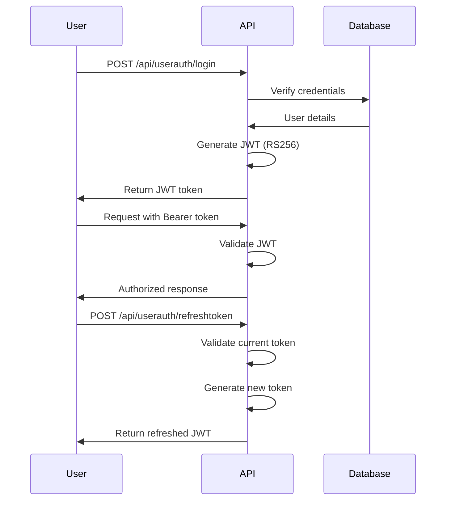

# User Authentication (JWT)

The User Authentication system provides JWT-based authentication for human users (researchers) accessing the PRISM system. This is completely separate from the node-to-node authentication system.

## Overview

**Purpose**: Authenticate human users (researchers) for system access
**Security**: JWT RS256 + SHA512 password hashing
**Token Type**: Bearer JWT in `Authorization` header
**Token Duration**: Configurable (default 1 hour)

## Authentication Flow



## Important Note

**This is NOT for node-to-node communication!**

- **User Auth**: For human users → Use JWT Bearer tokens
- **Node Auth**: For federated nodes → Use 4-phase handshake

## Endpoints

### POST /api/userauth/login

Authenticates a user and returns a JWT token.

#### Request

**Headers**:
```http
Content-Type: application/json
```

**Body**:
```json
{
  "email": "researcher@university.edu",
  "password": "SecurePassword123!"
}
```

**Field Descriptions**:
- `email`: User's email address
- `password`: User's password (will be hashed with SHA512)

#### Response

**Status**: 200 OK

**Body**:
```json
{
  "success": true,
  "token": "eyJhbGciOiJSUzI1NiIsInR5cCI6IkpXVCJ9...",
  "expiresIn": 3600,
  "expiresAt": "2025-10-23T11:00:00Z",
  "tokenType": "Bearer",
  "researcher": {
    "id": "f7e6d5c4-b3a2-1098-7654-321098765432",
    "name": "Dr. Jane Smith",
    "email": "researcher@university.edu",
    "role": "Researcher",
    "organization": "University Research Lab"
  }
}
```

**Field Descriptions**:
- `success`: Authentication result
- `token`: JWT token for API access
- `expiresIn`: Token lifetime in seconds
- `expiresAt`: Token expiration timestamp
- `tokenType`: Always "Bearer"
- `researcher`: Authenticated user details

#### Error Responses

**401 Unauthorized** - Invalid credentials
```json
{
  "success": false,
  "error": {
    "code": "ERR_INVALID_CREDENTIALS",
    "message": "Invalid email or password"
  }
}
```

**400 Bad Request** - Missing fields
```json
{
  "success": false,
  "error": {
    "code": "ERR_MISSING_FIELDS",
    "message": "Email and password are required"
  }
}
```

**403 Forbidden** - Account disabled
```json
{
  "success": false,
  "error": {
    "code": "ERR_ACCOUNT_DISABLED",
    "message": "Account has been disabled"
  }
}
```

#### curl Example

```bash
curl -X POST http://localhost:5000/api/userauth/login \
  -H "Content-Type: application/json" \
  -d '{
    "email": "researcher@university.edu",
    "password": "SecurePassword123!"
  }'
```

#### C# Client Example

```csharp
public async Task<LoginResponse> LoginAsync(string email, string password)
{
    var request = new UserLoginPayload
    {
        Email = email,
        Password = password
    };

    var response = await httpClient.PostAsJsonAsync(
        "/api/userauth/login",
        request
    );

    var loginResponse = await response.Content.ReadFromJsonAsync<LoginResponse>();

    if (loginResponse.Success)
    {
        // Store token for subsequent requests
        httpClient.DefaultRequestHeaders.Authorization =
            new AuthenticationHeaderValue("Bearer", loginResponse.Token);
    }

    return loginResponse;
}
```

#### JavaScript/TypeScript Example

```typescript
async function login(email: string, password: string): Promise<LoginResponse> {
    const response = await fetch('http://localhost:5000/api/userauth/login', {
        method: 'POST',
        headers: {
            'Content-Type': 'application/json'
        },
        body: JSON.stringify({
            email,
            password
        })
    });

    const data = await response.json();

    if (data.success) {
        // Store token in localStorage or secure storage
        localStorage.setItem('jwt_token', data.token);
        localStorage.setItem('token_expires', data.expiresAt);
    }

    return data;
}
```

---

### POST /api/userauth/refreshtoken

Refreshes an existing JWT token before it expires.

#### Request

**Headers**:
```http
Authorization: Bearer {current_jwt_token}
Content-Type: application/json
```

**Body**:
```json
{
  "researchId": "f7e6d5c4-b3a2-1098-7654-321098765432"
}
```

**Field Descriptions**:
- `researchId`: The researcher's ID (from the JWT claims)

#### Response

**Status**: 200 OK

**Body**:
```json
{
  "success": true,
  "token": "eyJhbGciOiJSUzI1NiIsInR5cCI6IkpXVCJ9...",
  "expiresIn": 3600,
  "expiresAt": "2025-10-23T12:00:00Z",
  "tokenType": "Bearer",
  "message": "Token refreshed successfully"
}
```

#### Error Responses

**401 Unauthorized** - Invalid or expired token
```json
{
  "success": false,
  "error": {
    "code": "ERR_INVALID_TOKEN",
    "message": "Token is invalid or expired"
  }
}
```

**403 Forbidden** - Token not eligible for refresh
```json
{
  "success": false,
  "error": {
    "code": "ERR_TOKEN_NOT_REFRESHABLE",
    "message": "Token cannot be refreshed"
  }
}
```

#### curl Example

```bash
# Refresh token
curl -X POST http://localhost:5000/api/userauth/refreshtoken \
  -H "Authorization: Bearer $JWT_TOKEN" \
  -H "Content-Type: application/json" \
  -d '{
    "researchId": "f7e6d5c4-b3a2-1098-7654-321098765432"
  }'
```

#### C# Client Example

```csharp
public async Task<RefreshTokenResponse> RefreshTokenAsync(
    string currentToken,
    Guid researcherId)
{
    var request = new HttpRequestMessage(
        HttpMethod.Post,
        "/api/userauth/refreshtoken"
    );

    request.Headers.Authorization =
        new AuthenticationHeaderValue("Bearer", currentToken);

    request.Content = JsonContent.Create(new { researchId = researcherId });

    var response = await httpClient.SendAsync(request);
    var refreshResponse = await response.Content.ReadFromJsonAsync<RefreshTokenResponse>();

    if (refreshResponse.Success)
    {
        // Update stored token
        httpClient.DefaultRequestHeaders.Authorization =
            new AuthenticationHeaderValue("Bearer", refreshResponse.Token);
    }

    return refreshResponse;
}
```

---

### POST /api/userauth/encrypt

Utility endpoint to encrypt text using the system's encryption (for testing/debugging).

#### Request

**Headers**:
```http
Content-Type: application/json
```

**Body**:
```json
{
  "text": "Plain text to encrypt"
}
```

#### Response

**Status**: 200 OK

**Body**:
```json
{
  "encrypted": "a3f2b1c4d5e6f7g8h9i0j1k2l3m4n5o6p7q8r9s0t1u2v3w4x5y6z7",
  "algorithm": "SHA512"
}
```

#### curl Example

```bash
curl -X POST http://localhost:5000/api/userauth/encrypt \
  -H "Content-Type: application/json" \
  -d '{
    "text": "MySecretPassword"
  }'
```

---

## JWT Token Structure

### Token Header
```json
{
  "alg": "RS256",
  "typ": "JWT",
  "kid": "prism-2025-01"
}
```

### Token Payload (Claims)
```json
{
  "sub": "f7e6d5c4-b3a2-1098-7654-321098765432",
  "email": "researcher@university.edu",
  "name": "Dr. Jane Smith",
  "role": "Researcher",
  "org": "University Research Lab",
  "iat": 1729684800,
  "exp": 1729688400,
  "iss": "PRISM-IRN",
  "aud": "prism-api"
}
```

**Standard Claims**:
- `sub`: Subject (Researcher ID)
- `iat`: Issued at (Unix timestamp)
- `exp`: Expiration (Unix timestamp)
- `iss`: Issuer
- `aud`: Audience

**Custom Claims**:
- `email`: User's email
- `name`: Full name
- `role`: User role
- `org`: Organization

### Signature Algorithm

The JWT is signed using RS256 (RSA with SHA-256):

```csharp
// Key generation
using var rsa = RSA.Create(2048);
var privateKey = rsa.ExportRSAPrivateKey();
var publicKey = rsa.ExportRSAPublicKey();

// Token signing
var signingCredentials = new SigningCredentials(
    new RsaSecurityKey(rsa),
    SecurityAlgorithms.RsaSha256
);
```

## Security Configuration

### Password Hashing

Passwords are hashed using SHA512:

```csharp
public string HashPassword(string password)
{
    using var sha512 = SHA512.Create();
    var bytes = Encoding.UTF8.GetBytes(password);
    var hash = sha512.ComputeHash(bytes);
    return Convert.ToBase64String(hash);
}
```

### Master Password Override

For development/testing, a master password can be configured:

```json
{
  "Authentication": {
    "MasterPasswordHash": "sha512-hash-of-master-password",
    "EnableMasterPassword": false  // Set to true only in dev
  }
}
```

**⚠️ WARNING**: Never enable master password in production!

### Token Validation

```csharp
var validationParameters = new TokenValidationParameters
{
    ValidateIssuerSigningKey = true,
    IssuerSigningKey = new RsaSecurityKey(publicKey),
    ValidateIssuer = true,
    ValidIssuer = "PRISM-IRN",
    ValidateAudience = true,
    ValidAudience = "prism-api",
    ValidateLifetime = true,
    ClockSkew = TimeSpan.FromMinutes(5)
};
```

## Using JWT in Protected Endpoints

### Protecting an Endpoint

```csharp
[ApiController]
[Route("api/research")]
public class ResearchController : ControllerBase
{
    [HttpGet("data")]
    [Authorize("sub")]  // Requires valid JWT with 'sub' claim
    public IActionResult GetResearchData()
    {
        var researcherId = User.FindFirst("sub")?.Value;
        // ... fetch data for this researcher
    }

    [HttpPost("admin")]
    [Authorize("role")]  // Requires specific role
    public IActionResult AdminOperation()
    {
        var role = User.FindFirst("role")?.Value;
        if (role != "Admin")
        {
            return Forbid();
        }
        // ... perform admin operation
    }
}
```

### Making Authenticated Requests

```bash
# Store token after login
JWT_TOKEN=$(curl -s -X POST http://localhost:5000/api/userauth/login \
  -H "Content-Type: application/json" \
  -d '{"email":"researcher@university.edu","password":"pass"}' \
  | jq -r '.token')

# Use token in subsequent requests
curl -X GET http://localhost:5000/api/research/data \
  -H "Authorization: Bearer $JWT_TOKEN"
```

## Token Refresh Strategy

### Automatic Refresh

```javascript
class TokenManager {
    constructor() {
        this.token = null;
        this.expiresAt = null;
        this.refreshTimer = null;
    }

    setToken(token, expiresAt) {
        this.token = token;
        this.expiresAt = new Date(expiresAt);

        // Schedule refresh 5 minutes before expiry
        const refreshTime = this.expiresAt.getTime() - Date.now() - (5 * 60 * 1000);

        if (this.refreshTimer) {
            clearTimeout(this.refreshTimer);
        }

        this.refreshTimer = setTimeout(() => {
            this.refreshToken();
        }, refreshTime);
    }

    async refreshToken() {
        try {
            const response = await fetch('/api/userauth/refreshtoken', {
                method: 'POST',
                headers: {
                    'Authorization': `Bearer ${this.token}`,
                    'Content-Type': 'application/json'
                },
                body: JSON.stringify({
                    researchId: this.getResearcherId()
                })
            });

            const data = await response.json();
            if (data.success) {
                this.setToken(data.token, data.expiresAt);
            }
        } catch (error) {
            console.error('Token refresh failed:', error);
            // Redirect to login
        }
    }
}
```

## Testing Authentication

### Complete Authentication Test

```bash
#!/bin/bash
# test-user-auth.sh

API_URL="http://localhost:5000"

echo "Testing User Authentication"
echo "=========================="

# 1. Test login
echo -e "\n1. Testing login..."
LOGIN_RESPONSE=$(curl -s -X POST $API_URL/api/userauth/login \
  -H "Content-Type: application/json" \
  -d '{
    "email": "test@example.com",
    "password": "TestPassword123!"
  }')

TOKEN=$(echo $LOGIN_RESPONSE | jq -r '.token')
RESEARCHER_ID=$(echo $LOGIN_RESPONSE | jq -r '.researcher.id')

echo "Login successful. Token obtained."

# 2. Test authenticated request
echo -e "\n2. Testing authenticated request..."
curl -s -X GET $API_URL/api/research/data \
  -H "Authorization: Bearer $TOKEN" | jq '.'

# 3. Test token refresh
echo -e "\n3. Testing token refresh..."
REFRESH_RESPONSE=$(curl -s -X POST $API_URL/api/userauth/refreshtoken \
  -H "Authorization: Bearer $TOKEN" \
  -H "Content-Type: application/json" \
  -d "{\"researchId\": \"$RESEARCHER_ID\"}")

NEW_TOKEN=$(echo $REFRESH_RESPONSE | jq -r '.token')
echo "Token refreshed successfully."

# 4. Test with new token
echo -e "\n4. Testing with refreshed token..."
curl -s -X GET $API_URL/api/research/data \
  -H "Authorization: Bearer $NEW_TOKEN" | jq '.'

echo -e "\nUser authentication test complete!"
```

## Common Issues

### Issue: "Invalid email or password"
**Cause**: Incorrect credentials
**Solution**: Verify email and password, check password hashing

### Issue: "Token is invalid or expired"
**Cause**: JWT has expired
**Solution**: Implement automatic token refresh

### Issue: "Account has been disabled"
**Cause**: User account deactivated
**Solution**: Contact administrator to reactivate

### Issue: "Signature validation failed"
**Cause**: Token tampered or wrong signing key
**Solution**: Ensure correct public key for validation

## Security Best Practices

1. **Never store passwords in plain text** - Always hash with SHA512
2. **Use HTTPS in production** - Protect tokens in transit
3. **Implement token refresh** - Don't make tokens last too long
4. **Validate all claims** - Check issuer, audience, expiration
5. **Store tokens securely** - Use secure storage on client
6. **Implement logout** - Clear tokens on logout
7. **Monitor failed attempts** - Detect brute force attacks
8. **Use strong passwords** - Enforce password complexity

## Differences from Node Authentication

| Aspect | User Authentication | Node Authentication |
|--------|-------------------|-------------------|
| **Purpose** | Human users | Node-to-node communication |
| **Token Type** | JWT Bearer | Session GUID |
| **Header** | `Authorization: Bearer` | `X-Session-Id` |
| **Duration** | 1 hour (configurable) | 1 hour (renewable) |
| **Signature** | RS256 (RSA) | RSA-2048 + ECDH |
| **Storage** | Client-side | Server-side (Redis) |
| **Phases** | Single login | 4-phase handshake |

---

**Related Documentation**:
- [Phase 4: Session Management](phase4-session.md) - For node authentication
- [Security Overview](../SECURITY_OVERVIEW.md)
- [User Management](../components/USER_MANAGEMENT.md)