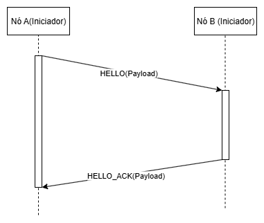

# Protocolo de Handshake entre Nós IRN

**Status**: ✅ Fase 3 Completa | 📋 Fase 4 Planejada
**Última atualização**: 2025-10-03 - 06:00
**Responsável**: Desenvolvimento inicial

## Visão Geral

O protocolo de handshake estabelece confiança e autenticação mútua entre duas instâncias do IRN antes de permitir troca de dados de pesquisa.

## Objetivos
1. **Criar canal de comunicação segura**: O nó solicitante deve requisitar a criação de um canal oferecendo sua chave pública
2. **Identificação e Autorização**: Verificar se o nó requisitante é conhecido e autorizado na rede
3. **Autenticação Mútua**: Ambos os nós devem verificar a identidade um do outro
4. **Estabelecimento de Confiança**: Validação de certificados e credenciais
5. **Negociação de Capacidades**: Identificar funcionalidades suportadas por cada nó
6. **Criação de Sessão Segura**: Estabelecer canal criptografado para comunicação

## Fluxo do Handshake

### Fase 1: Abrindo o Canal de Comunicação Criptografado

```
Nó A (Iniciador)                    Nó B (Receptor)
     |                                    |
     |------ CHANNEL_OPEN --------------->|
     |       (chave pública do canal)     |
     |                                    |
     |<----- CHANNEL_READY ---------------|
     |       (chave pública do canal)     |
     |                                    |
```



**Objetivo**: Estabelecer um canal criptografado assimetricamente entre os nós com chaves descartáveis **antes** de qualquer troca de informações sensíveis.

**Payload CHANNEL_OPEN:**
```json
{
  "protocolVersion": "1.0",
  "ephemeralPublicKey": "base64-encoded-ephemeral-public-key",
  "keyExchangeAlgorithm": "ECDH-P384",
  "supportedCiphers": ["AES-256-GCM", "ChaCha20-Poly1305"],
  "timestamp": "2025-10-01T12:00:00Z",
  "nonce": "random-nonce-123"
}
```

**Payload CHANNEL_READY:**
```json
{
  "protocolVersion": "1.0",
  "ephemeralPublicKey": "base64-encoded-ephemeral-public-key",
  "keyExchangeAlgorithm": "ECDH-P384",
  "selectedCipher": "AES-256-GCM",
  "timestamp": "2025-10-01T12:00:00Z",
  "nonce": "random-nonce-456"
}
```

**Detalhes Técnicos**:
- Cada nó gera um **par de chaves efêmeras** (descartáveis) especificamente para esta sessão
- As chaves públicas efêmeras são trocadas usando **ECDH** (Elliptic Curve Diffie-Hellman)
- Um **segredo compartilhado** é derivado a partir das chaves efêmeras
- O segredo compartilhado é usado para derivar chaves simétricas (via HKDF)
- As **chaves efêmeras são descartadas** ao final da sessão
- Isto proporciona **Perfect Forward Secrecy (PFS)**: mesmo que chaves privadas permanentes sejam comprometidas no futuro, sessões passadas permanecem seguras

**✅ IMPLEMENTADO - REQUISITO CRÍTICO DE SEGURANÇA**: A partir deste ponto, **TODAS as mensagens** subsequentes (Fases 2, 3 e 4) **SÃO criptografadas** usando as chaves simétricas derivadas do canal estabelecido na Fase 1.

**Implementação via `PrismEncryptedChannelConnectionAttribute<T>`** (`IAsyncResourceFilter`):
- O `ChannelId` retornado no header `X-Channel-Id` da resposta `CHANNEL_READY` é incluído em **todas** as requisições subsequentes
- Cada requisição inclui no header: `X-Channel-Id: {channelId}`
- O payload de todas as mensagens das Fases 2-4 é criptografado com AES-256-GCM usando a chave simétrica derivada
- O atributo valida que o `ChannelId` existe e não está expirado antes de processar qualquer requisição
- O atributo descriptografa automaticamente o payload usando a chave simétrica associada ao canal
- Para `NodeIdentifyRequest`, o atributo também verifica a assinatura RSA do nó
- O request descriptografado é armazenado em `HttpContext.Items["DecryptedRequest"]`
- Respostas são criptografadas usando `ChannelEncryptionService.EncryptPayload()`

**Formato do Payload Criptografado**:
```json
{
  "encryptedData": "base64-encoded-encrypted-payload",
  "iv": "base64-encoded-initialization-vector",
  "authTag": "base64-encoded-authentication-tag"
}
```

### Fase 2: Identificação e Autorização

```
Nó A (Iniciador)                    Nó B (Receptor)
     |                                    |
     |------ NODE_IDENTIFY -------------->|
     |       (nodeId, credentials)        |
     |                                    |
     |<----- NODE_STATUS -----------------|
     |       (known/unknown + info)       |
     |                                    |
```

**Objetivo**: Verificar se o nó requisitante é conhecido e autorizado na rede.

**⚠️ REQUISITO**: Esta requisição **DEVE** ser enviada dentro do canal criptografado estabelecido na Fase 1. O header `X-Channel-Id` é obrigatório.

**Headers Obrigatórios**:
```
X-Channel-Id: {channelId-obtido-na-fase-1}
Content-Type: application/json
```

**Payload NODE_IDENTIFY (criptografado com chave do canal):**
```json
{
  "nodeId": "uuid-do-no-a",
  "nodeName": "IRN-Hospital-XYZ",
  "nodePublicKey": "base64-encoded-public-key",
  "institutionId": "uuid-instituicao",
  "capabilities": [
    "biosignal-storage",
    "metadata-query",
    "federated-search"
  ],
  "timestamp": "2025-10-01T12:00:01Z",
  "nonce": "random-nonce-789"
}
```

**Payload NODE_STATUS - Nó Conhecido (criptografado):**
```json
{
  "status": "known",
  "nodeId": "uuid-do-no-b",
  "nodeName": "IRN-Lab-ABC",
  "nodePublicKey": "base64-encoded-public-key",
  "institutionId": "uuid-instituicao-b",
  "capabilities": [
    "biosignal-storage",
    "metadata-query"
  ],
  "timestamp": "2025-10-01T12:00:02Z"
}
```

**Payload NODE_STATUS - Nó Desconhecido (criptografado):**
```json
{
  "status": "unknown",
  "message": "Node not registered in the network",
  "registrationRequired": true,
  "registrationEndpoint": "https://node-b.example.com/api/node/register",
  "timestamp": "2025-10-01T12:00:02Z"
}
```

**Fluxo para Nó Desconhecido**:
1. Nó B retorna `NODE_STATUS` com `status: "unknown"`
2. Nó A deve iniciar processo de cadastro através do `registrationEndpoint`
3. Após cadastro, Nó A aguarda aprovação/liberação por administrador do Nó B
4. Nó A pode tentar novo handshake após aprovação

### Fase 3: Autenticação Mútua ✅ IMPLEMENTADO

**Pré-requisito**: Esta fase só ocorre se o Nó retornou `status: "authorized"` na Fase 2.

**✅ IMPLEMENTADO**: Todas as mensagens desta fase **SÃO criptografadas** usando o canal estabelecido na Fase 1. O header `X-Channel-Id` é obrigatório em todas as requisições.

```
Nó A (Iniciador)                    Nó B (Receptor)
     |                                    |
     |------ CHALLENGE_REQUEST ---------->|
     |       (NodeId, Timestamp)          |
     |                                    |
     |<----- CHALLENGE_RESPONSE ----------|
     |       (32-byte random challenge)   |
     |                                    |
     |------ AUTHENTICATE --------------->|
     |       (signed challenge)           |
     |                                    |
     |<----- AUTHENTICATION_RESPONSE -----|
     |       (session token, capabilities)|
     |                                    |
```

**CHALLENGE_REQUEST (criptografado via AES-256-GCM):**
```json
{
  "channelId": "channel-uuid",
  "nodeId": "uuid-do-no-a",
  "timestamp": "2025-10-03T00:00:00Z"
}
```

**CHALLENGE_RESPONSE (criptografado via AES-256-GCM):**
```json
{
  "challengeData": "base64-encoded-32-byte-random-value",
  "challengeTimestamp": "2025-10-03T00:00:01Z",
  "challengeTtlSeconds": 300,
  "expiresAt": "2025-10-03T00:05:01Z"
}
```

**AUTHENTICATE (criptografado via AES-256-GCM):**
```json
{
  "channelId": "channel-uuid",
  "nodeId": "uuid-do-no-a",
  "challengeData": "base64-encoded-32-byte-random-value",
  "signature": "base64-rsa-signature-of-challenge+channelId+nodeId+timestamp",
  "timestamp": "2025-10-03T00:00:02Z"
}
```

**AUTHENTICATION_RESPONSE (criptografado via AES-256-GCM):**
```json
{
  "authenticated": true,
  "nodeId": "uuid-do-no-a",
  "sessionToken": "session-token-guid",
  "sessionExpiresAt": "2025-10-03T01:00:02Z",
  "grantedCapabilities": ["search", "retrieve"],
  "message": "Authentication successful",
  "nextPhase": "phase4_session",
  "timestamp": "2025-10-03T00:00:02Z"
}
```

**Detalhes Técnicos**:
- **Challenge TTL**: 5 minutos (300 segundos)
- **Session Token TTL**: 1 hora (3600 segundos)
- **Signature Format**: RSA-2048 signature of `{ChallengeData}{ChannelId}{NodeId}{Timestamp:O}`
- **Challenge Storage**: In-memory `ConcurrentDictionary<string, ChallengeData>` (key: `{ChannelId}:{NodeId}`)
- **One-time Use**: Challenge is invalidated after successful authentication or expiration
- **Verification**: Uses node's registered certificate public key for signature verification

**Production Endpoints**:
- `POST /api/node/challenge` (decorated with `[PrismEncryptedChannelConnection<ChallengeRequest>]`)
- `POST /api/node/authenticate` (decorated with `[PrismEncryptedChannelConnection<ChallengeResponseRequest>]`)

**Testing Helper Endpoints** (Development/NodeA/NodeB environments only):
- `POST /api/testing/request-challenge` - Client-side wrapper that calls `NodeChannelClient.RequestChallengeAsync()`
  - Input: `{channelId, nodeId}`
  - Output: Challenge response with instructions for next step
- `POST /api/testing/sign-challenge` - Helper to sign challenge data in correct format
  - Input: `{challengeData, channelId, nodeId, certificateWithPrivateKey, password, timestamp}`
  - Output: `{signature, signedData}` - signature in correct format for authentication
  - Eliminates manual formatting errors when testing
- `POST /api/testing/authenticate` - Client-side wrapper that calls `NodeChannelClient.AuthenticateAsync()`
  - Input: `{channelId, nodeId, challengeData, signature, timestamp}`
  - Output: Authentication response with session token

**Manual Testing Script**:
- `test-phase3.sh` - Complete end-to-end Bash script that tests Phases 1→2→3
  - Establishes encrypted channel
  - Generates certificate
  - Registers node
  - Approves node
  - Requests challenge
  - Signs challenge
  - Authenticates and obtains session token

### Fase 4: Estabelecimento de Sessão

**Pré-requisito**: Esta fase só ocorre após autenticação mútua bem-sucedida (Fase 3).

**⚠️ REQUISITO**: Todas as mensagens desta fase **DEVEM** ser criptografadas usando o canal estabelecido na Fase 1. O header `X-Channel-Id` é obrigatório em todas as requisições.

```
Nó A (Iniciador)                    Nó B (Receptor)
     |                                    |
     |------ SESSION_CREATE ------------->|
     |                                    |
     |<----- SESSION_CREATED -------------|
     |       (sessionId, sessionKey)      |
     |                                    |
     |------ SESSION_READY -------------->|
     |                                    |
```

**SESSION_CREATE (criptografado):**
```json
{
  "requestedCapabilities": [
    "biosignal-query",
    "metadata-search"
  ],
  "sessionDuration": 21600,
  "timestamp": "2025-10-01T12:00:07Z"
}
```

**SESSION_CREATED (criptografado):**
```json
{
  "sessionId": "uuid-sessao",
  "sessionKey": "encrypted-symmetric-key",
  "expiresAt": "2025-10-01T18:00:07Z",
  "refreshToken": "base64-refresh-token",
  "grantedCapabilities": {
    "maxRequestSize": 10485760,
    "supportedQueries": ["metadata", "biosignal", "study"],
    "rateLimit": {
      "requestsPerMinute": 60,
      "concurrentConnections": 5
    }
  },
  "timestamp": "2025-10-01T12:00:08Z"
}
```

**SESSION_READY (criptografado):**
```json
{
  "sessionId": "uuid-sessao",
  "status": "ready",
  "timestamp": "2025-10-01T12:00:09Z"
}
```

## Resumo do Fluxo Completo

### Cenário 1: Nó Conhecido e Autorizado (Handshake Completo)
1. **Fase 1**: Nó A abre canal criptografado com Nó B
2. **Fase 2**: Nó A se identifica → Nó B responde `status: "known"` com suas informações
3. **Fase 3**: Autenticação mútua via desafio/resposta
4. **Fase 4**: Criação de sessão com capabilities negociadas

**Resultado**: Sessão estabelecida, comunicação autorizada.

### Cenário 2: Nó Desconhecido (Requer Cadastro)
1. **Fase 1**: Nó A abre canal criptografado com Nó B
2. **Fase 2**: Nó A se identifica → Nó B responde `status: "unknown"` com endpoint de registro
3. Nó A inicia processo de cadastro (fora do handshake)
4. Administrador do Nó B aprova/rejeita cadastro
5. Se aprovado, Nó A pode reiniciar handshake (volta ao Cenário 1)

**Resultado**: Handshake interrompido, cadastro necessário.

## Segurança

### Criptografia

**Fase 1 - Estabelecimento de Canal (Chaves Efêmeras)**:
- **Troca de Chaves**: ECDH (Elliptic Curve Diffie-Hellman) com curva P-384
- **Chaves Efêmeras**: Par de chaves temporárias geradas para cada sessão
- **Derivação de Chaves**: HKDF-SHA256 para derivar chaves simétricas do segredo compartilhado
- **Perfect Forward Secrecy (PFS)**: Comprometimento de chaves permanentes não afeta sessões passadas

**Fases 2-4 - Comunicação sobre o Canal**:
- **Simétrica**: AES-256-GCM (chave derivada do ECDH)
- **Assinatura Digital**: ECDSA P-384 ou RSA 4096 (usando chaves permanentes dos nós)
- **Hash**: SHA-256 para verificação de integridade

**Chaves Permanentes vs Efêmeras**:
- **Chaves Permanentes**: Usadas apenas para assinaturas digitais (autenticação na Fase 3)
- **Chaves Efêmeras**: Usadas para criptografia do canal (Fase 1) e descartadas após sessão

### Certificados
- Cada nó deve possuir certificado X.509 válido
- Suporte a PKI institucional ou certificados auto-assinados (com registro prévio)
- Validação de revogação (CRL/OCSP)

### Prevenção de Ataques
- **Replay Attack**: Nonces únicos com timestamp em todas as mensagens
- **Man-in-the-Middle**:
  - Chaves efêmeras com ECDH (Fase 1)
  - Validação de assinaturas com chaves permanentes (Fase 3)
  - Validação de certificados X.509
  - Certificate pinning opcional
- **Perfect Forward Secrecy**: Chaves efêmeras descartadas garantem que comprometimento futuro não afeta sessões passadas
- **Key Compromise Impersonation**: Autenticação mútua na Fase 3 com chaves permanentes
- **DoS**: Rate limiting e timeout agressivo no handshake

## Tratamento de Erros

### Códigos de Erro Comuns

| Código | Descrição | Fase | Ação |
|--------|-----------|------|------|
| `ERR_CHANNEL_FAILED` | Falha ao estabelecer canal criptografado | 1 | Verificar suporte a cifras/ECDH |
| `ERR_INVALID_EPHEMERAL_KEY` | Chave efêmera inválida ou malformada | 1 | Regenerar par de chaves efêmeras |
| `ERR_KEY_DERIVATION_FAILED` | Falha na derivação de chave compartilhada | 1 | Verificar implementação ECDH/HKDF |
| `ERR_INVALID_CERTIFICATE` | Certificado inválido ou expirado | 1-3 | Renovar certificado |
| `ERR_UNKNOWN_NODE` | Nó não registrado na federação | 2 | Registrar nó |
| `ERR_NODE_UNAUTHORIZED` | Nó conhecido mas não autorizado | 2 | Aguardar aprovação |
| `ERR_INCOMPATIBLE_VERSION` | Versão do protocolo incompatível | 1-2 | Atualizar software |
| `ERR_AUTH_FAILED` | Falha na autenticação | 3 | Verificar credenciais |
| `ERR_TIMEOUT` | Timeout durante handshake | Todas | Verificar conectividade |
| `ERR_INVALID_SIGNATURE` | Assinatura inválida (chave permanente) | 3 | Verificar chaves permanentes |

### Exemplos de Resposta de Erro

**ERR_UNKNOWN_NODE (Fase 2):**
```json
{
  "error": {
    "code": "ERR_UNKNOWN_NODE",
    "message": "Node not registered in the network",
    "details": {
      "registrationRequired": true,
      "registrationEndpoint": "https://node-b.example.com/api/node/register"
    },
    "retryable": true,
    "retryAfter": "after_registration"
  }
}
```

**ERR_INVALID_CERTIFICATE (Fase 1):**
```json
{
  "error": {
    "code": "ERR_INVALID_CERTIFICATE",
    "message": "Certificate has expired",
    "details": {
      "certificateExpiry": "2025-09-01T00:00:00Z",
      "currentTime": "2025-10-01T12:00:00Z"
    },
    "retryable": false
  }
}
```

**ERR_INVALID_EPHEMERAL_KEY (Fase 1):**
```json
{
  "error": {
    "code": "ERR_INVALID_EPHEMERAL_KEY",
    "message": "Ephemeral public key is invalid or malformed",
    "details": {
      "reason": "invalid_curve_point"
    },
    "retryable": true
  }
}
```

**ERR_AUTH_FAILED (Fase 3):**
```json
{
  "error": {
    "code": "ERR_AUTH_FAILED",
    "message": "Authentication challenge verification failed",
    "details": {
      "reason": "invalid_signature"
    },
    "retryable": false
  }
}
```

## Implementação

### Estado Atual
📋 **Planejado** - Implementação ainda não iniciada

### Próximos Passos

1. **Criar Models** (`Bioteca.Prism.InteroperableResearchNode/Models/Node/`)
   - [ ] `ChannelOpenRequest.cs` / `ChannelReadyResponse.cs` (Fase 1)
   - [ ] `NodeIdentifyRequest.cs` / `NodeStatusResponse.cs` (Fase 2)
   - [ ] `NodeInfo.cs`
   - [ ] `AuthChallengeRequest.cs` / `AuthResponse.cs` (Fase 3)
   - [ ] `SessionCreateRequest.cs` / `SessionCreatedResponse.cs` (Fase 4)
   - [ ] `SessionInfo.cs`
   - [ ] `HandshakeError.cs`

2. **Criar Serviços** (`Services/Node/`)
   - [ ] `IEphemeralKeyService.cs` / `EphemeralKeyService.cs` (geração de chaves efêmeras ECDH)
   - [ ] `IChannelEncryptionService.cs` / `ChannelEncryptionService.cs` (Fase 1 - derivação HKDF)
   - [ ] `INodeRegistrationService.cs` / `NodeRegistrationService.cs` (Fase 2)
   - [ ] `INodeAuthenticationService.cs` / `NodeAuthenticationService.cs` (Fase 3)
   - [ ] `ICertificateValidationService.cs` / `CertificateValidationService.cs`
   - [ ] `ISessionManagementService.cs` / `SessionManagementService.cs` (Fase 4)

3. **Criar Controllers** (`Controllers/`)
   - [ ] `NodeHandshakeController.cs` (endpoints para todas as fases)
   - [ ] `NodeRegistrationController.cs` (cadastro de nós desconhecidos)

4. **Configuração**
   - [ ] Adicionar configurações de certificados no `appsettings.json`
   - [ ] Configurar algoritmo de troca de chaves (ECDH curve) no `appsettings.json`
   - [ ] Configurar cifras simétricas suportadas (AES-256-GCM, etc.) no `appsettings.json`
   - [ ] Configurar tempo de vida das chaves efêmeras
   - [ ] Configurar middleware de autenticação no `Program.cs`
   - [ ] Configurar lista de nós conhecidos/autorizados

### Referências de Código

Quando implementado, os principais arquivos estarão em:
- `Controllers/NodeHandshakeController.cs:*` - Endpoints para todas as fases do protocolo
- `Controllers/NodeRegistrationController.cs:*` - Endpoint de cadastro de nós
- `Services/Node/EphemeralKeyService.cs:*` - Geração e gerenciamento de chaves efêmeras ECDH
- `Services/Node/ChannelEncryptionService.cs:*` - Derivação de chaves simétricas (HKDF) e criptografia do canal (Fase 1)
- `Services/Node/NodeRegistrationService.cs:*` - Gerenciamento de nós conhecidos (Fase 2)
- `Services/Node/NodeAuthenticationService.cs:*` - Autenticação mútua com chaves permanentes (Fase 3)
- `Services/Node/SessionManagementService.cs:*` - Gerenciamento de sessões (Fase 4)
- `Models/Node/`:* - Todos os DTOs de requisição/resposta

## Testes

### Cenários de Teste

1. **Handshake Completo (Nó Conhecido)**
   - Dois nós conhecidos com certificados válidos
   - Verificar todas as 4 fases executam corretamente
   - Verificar criação de sessão

2. **Nó Desconhecido**
   - Nó A tenta se conectar ao Nó B
   - Nó B não reconhece Nó A
   - Verificar retorno de `status: "unknown"` com endpoint de registro
   - Verificar que handshake é interrompido na Fase 2

3. **Canal Criptografado com Chaves Efêmeras (Fase 1)**
   - Verificar geração correta de chaves efêmeras ECDH
   - Verificar troca de chaves públicas efêmeras
   - Verificar derivação do segredo compartilhado (ECDH)
   - Verificar derivação de chaves simétricas (HKDF)
   - Testar com cifras incompatíveis
   - Verificar que dados sensíveis não são transmitidos antes do canal
   - Verificar descarte de chaves efêmeras ao final da sessão

4. **Certificado Expirado**
   - Nó com certificado expirado
   - Verificar rejeição apropriada na Fase 1

5. **Autenticação Falha (Fase 3)**
   - Assinatura inválida no desafio
   - Verificar rejeição e código de erro apropriado

6. **Versão Incompatível**
   - Nós com versões diferentes do protocolo
   - Verificar erro claro na Fase 1

7. **Timeout**
   - Simular latência de rede em cada fase
   - Verificar comportamento de timeout

8. **Replay Attack**
   - Reenviar mensagem de handshake
   - Verificar rejeição por nonce duplicado

9. **Man-in-the-Middle**
   - Simular interceptação do canal
   - Verificar que dados sensíveis estão criptografados
   - Verificar que chaves efêmeras não podem ser reutilizadas

10. **Perfect Forward Secrecy**
   - Simular comprometimento de chave permanente após sessão
   - Verificar que dados da sessão passada não podem ser decriptados
   - Confirmar que chaves efêmeras foram descartadas

## Contexto para IA

### Prompt Sugerido para Continuação

```
Implementar o protocolo de handshake revisado conforme especificado em
docs/architecture/handshake-protocol.md:

1. Fase 1 (Canal Criptografado): Criar models ChannelOpenRequest e
   ChannelReadyResponse, implementar ChannelEncryptionService e endpoint
   /api/channel/open

2. Fase 2 (Identificação): Criar models NodeIdentifyRequest e NodeStatusResponse,
   implementar NodeRegistrationService e endpoint /api/node/identify

3. Fase 3 (Autenticação): Criar models de desafio/resposta de autenticação,
   implementar NodeAuthenticationService e endpoints de /api/node/challenge/response

4. Fase 4 (Sessão): Implementar SessionManagementService e endpoints de
   criação de sessão

Garantir que todas as comunicações após a Fase 1 sejam criptografadas através
do canal estabelecido.
```

### Dependências
- Este documento depende de: `node-communication.md`
- Este documento é dependência de: `session-management.md`

## Referências

- RFC 8446 (TLS 1.3) - Inspiração para mecanismo de handshake
- OAuth 2.0 mTLS - Padrão de autenticação mútua
- X.509 Certificate Standards
