# Complete Authentication Sequence Diagram (Phases 1-4)

**Version**: 0.8.0
**Last Updated**: 2025-10-07

This diagram shows the complete 4-phase handshake protocol with encrypted communication, PostgreSQL persistence, and session management.

```mermaid
sequenceDiagram
    participant NodeA as Node A (Client)
    participant NodeB as Node B (Server)
    participant Redis as Redis Cache
    participant PG as PostgreSQL DB

    Note over NodeA,PG: PHASE 1: Encrypted Channel Establishment
    NodeA->>NodeB: POST /api/channel/initiate<br/>(clientPublicKey, clientNonce, supportedCiphers)
    NodeB->>NodeB: Generate server ephemeral ECDH keys
    NodeB->>NodeB: Derive shared secret (ECDH)
    NodeB->>NodeB: Derive symmetric key (HKDF-SHA256)
    NodeB->>Redis: Store channel context (TTL: 30 min)
    NodeB->>NodeA: 200 OK (serverPublicKey, channelId, selectedCipher)<br/>Header: X-Channel-Id
    NodeA->>NodeA: Derive same symmetric key
    NodeA->>Redis: Store channel context (TTL: 30 min)
    Note over NodeA,PG: ✅ AES-256-GCM channel established (Perfect Forward Secrecy)

    Note over NodeA,PG: PHASE 2: Node Identification & Registration
    NodeA->>NodeA: Generate X.509 self-signed certificate (RSA-2048)
    NodeA->>NodeA: Calculate certificate fingerprint (SHA-256)
    NodeA->>NodeA: Sign identification request with private key
    NodeA->>NodeB: POST /api/channel/identify<br/>🔒 ENCRYPTED {nodeId, certificate, signature, timestamp}<br/>Header: X-Channel-Id
    NodeB->>NodeB: Decrypt payload with channel symmetric key
    NodeB->>NodeB: Verify RSA signature with public certificate
    NodeB->>NodeB: Calculate certificate fingerprint
    NodeB->>PG: SELECT by certificate_fingerprint
    PG->>NodeB: NULL (node unknown)
    NodeB->>NodeA: 🔒 ENCRYPTED {isKnown: false, registrationUrl}<br/>Status: 401 Unauthorized

    NodeA->>NodeB: POST /api/node/register<br/>🔒 ENCRYPTED {nodeId, nodeName, certificate, contactInfo}<br/>Header: X-Channel-Id
    NodeB->>NodeB: Decrypt payload
    NodeB->>NodeB: Generate Guid RegistrationId
    NodeB->>PG: INSERT INTO research_nodes<br/>(id=Guid, certificate_fingerprint=SHA256,<br/> status=Pending, node_access_level=ReadOnly)
    PG->>NodeB: RegistrationId (Guid)
    NodeB->>NodeA: 🔒 ENCRYPTED {success: true, registrationId: Guid,<br/>status: "Pending", nextPhase: null}

    Note over NodeB: 👤 Admin manually approves node
    NodeB->>PG: UPDATE research_nodes<br/>SET status = Authorized, node_access_level = ReadWrite<br/>WHERE id = RegistrationId

    NodeA->>NodeB: POST /api/channel/identify (retry)<br/>🔒 ENCRYPTED {nodeId, certificate, signature, timestamp}
    NodeB->>NodeB: Decrypt payload
    NodeB->>PG: SELECT by certificate_fingerprint
    PG->>NodeB: ResearchNode (id=Guid, status=Authorized, access_level=ReadWrite)
    NodeB->>Redis: UPDATE channel context<br/>(IdentifiedNodeId=Guid, CertificateFingerprint=SHA256)
    NodeB->>NodeA: 🔒 ENCRYPTED {isKnown: true, registrationId: Guid,<br/>status: "Authorized", accessLevel: "ReadWrite",<br/>nextPhase: "phase3_authenticate"}
    Note over NodeA,PG: ✅ Node identified and authorized in PostgreSQL

    Note over NodeA,PG: PHASE 3: Mutual Challenge-Response Authentication
    NodeA->>NodeB: POST /api/node/challenge<br/>🔒 ENCRYPTED {channelId, nodeId, timestamp}<br/>Header: X-Channel-Id
    NodeB->>NodeB: Decrypt payload
    NodeB->>NodeB: Verify node status = Authorized
    NodeB->>NodeB: Generate 32-byte random challenge
    NodeB->>NodeB: Store challenge in-memory<br/>(key: {channelId}:{nodeId}, TTL: 5 min)
    NodeB->>NodeA: 🔒 ENCRYPTED {challengeData, expiresAt, ttlSeconds: 300}

    NodeA->>NodeA: Sign data with RSA private key:<br/>{challengeData}{channelId}{nodeId}{timestamp:O}
    NodeA->>NodeB: POST /api/node/authenticate<br/>🔒 ENCRYPTED {channelId, nodeId, challengeData,<br/>signature, timestamp}<br/>Header: X-Channel-Id
    NodeB->>NodeB: Decrypt payload
    NodeB->>NodeB: Verify challenge data matches stored value
    NodeB->>NodeB: Verify challenge not expired (< 5 min)
    NodeB->>PG: SELECT certificate FROM research_nodes<br/>WHERE certificate_fingerprint = SHA256
    PG->>NodeB: Public certificate
    NodeB->>NodeB: Verify RSA signature with public certificate
    NodeB->>NodeB: Invalidate challenge (one-time use)
    NodeB->>NodeB: Generate session token (Guid, 32 chars)
    NodeB->>Redis: CREATE session<br/>(token, nodeId=Guid, channelId, accessLevel=ReadWrite,<br/>capabilities=["query:read","data:write"], TTL: 1 hour)
    NodeB->>PG: UPDATE research_nodes<br/>SET last_authenticated_at = NOW()<br/>WHERE id = RegistrationId
    NodeB->>NodeA: 🔒 ENCRYPTED {authenticated: true, sessionToken,<br/>sessionExpiresAt, grantedCapabilities: [...],<br/>nextPhase: "phase4_session"}
    Note over NodeA,PG: ✅ Mutually authenticated with session token

    Note over NodeA,PG: PHASE 4: Session Management & Access Control

    rect rgb(240, 255, 240)
    Note over NodeA,PG: WhoAmI - Verify Session
    NodeA->>NodeB: POST /api/session/whoami<br/>🔒 ENCRYPTED {channelId, sessionToken, timestamp}<br/>Header: X-Channel-Id
    NodeB->>NodeB: Decrypt payload (PrismEncryptedChannelConnection)
    NodeB->>Redis: GET session by token
    Redis->>NodeB: SessionContext (nodeId, accessLevel, expiresAt, requestCount)
    NodeB->>NodeB: Validate session not expired
    NodeB->>NodeB: Check rate limit (60 req/min via Redis Sorted Set)
    NodeB->>Redis: INCREMENT requestCount, ADD to rate limit window
    NodeB->>NodeA: 🔒 ENCRYPTED {nodeId, isValid: true,<br/>accessLevel: "ReadWrite", capabilities: [...],<br/>requestCount: 5, expiresAt, remainingTtl: 3540}
    end

    rect rgb(255, 255, 240)
    Note over NodeA,PG: Session Renewal
    NodeA->>NodeB: POST /api/session/renew<br/>🔒 ENCRYPTED {channelId, sessionToken, timestamp}
    NodeB->>Redis: GET session by token
    Redis->>NodeB: SessionContext
    NodeB->>Redis: UPDATE session<br/>(expiresAt = NOW + 1 hour, requestCount = 0, TTL = 3600)
    NodeB->>NodeA: 🔒 ENCRYPTED {success: true, sessionToken,<br/>expiresAt, extendedTtlSeconds: 3600}
    Note over NodeA,PG: ✅ Session renewed for +1 hour
    end

    rect rgb(255, 240, 240)
    Note over NodeA,PG: Session Revocation (Logout)
    NodeA->>NodeB: POST /api/session/revoke<br/>🔒 ENCRYPTED {channelId, sessionToken, timestamp}
    NodeB->>Redis: DELETE session by token
    NodeB->>Redis: DELETE rate limit data
    NodeB->>NodeA: 🔒 ENCRYPTED {success: true, revokedAt}
    Note over NodeA,PG: ✅ Session invalidated (requires re-authentication)
    end

    rect rgb(240, 240, 255)
    Note over NodeA,PG: Session Metrics (Admin Only)
    NodeA->>NodeB: POST /api/session/metrics<br/>🔒 ENCRYPTED {channelId, sessionToken, timestamp}
    NodeB->>Redis: GET session by token
    Redis->>NodeB: SessionContext (accessLevel = Admin)
    NodeB->>NodeB: Verify capability: NodeAccessTypeEnum.Admin
    NodeB->>Redis: KEYS session:* (get all active sessions)
    NodeB->>Redis: Aggregate metrics (total, by access level, by node)
    NodeB->>NodeA: 🔒 ENCRYPTED {totalActiveSessions: 12,<br/>sessionsByAccessLevel: {...},<br/>averageRequestsPerSession: 15.5}
    end
```

## Key Architecture Highlights

### Dual-Identifier System
1. **NodeId (string)**: Protocol-level identifier (e.g., "node-a", "hospital-research-node")
   - Used in all Phase 2-3 requests for external communication
   - **NOT stored in database**

2. **RegistrationId (Guid)**: Database primary key
   - Generated by PostgreSQL (`gen_random_uuid()`)
   - Returned in `NodeStatusResponse` after Phase 2 identification
   - Used for administrative operations (`PUT /api/node/{id:guid}/status`)

3. **Certificate Fingerprint (SHA-256)**: Natural key for authentication
   - Unique constraint in PostgreSQL
   - Used for node lookups during identification

### Persistence Layers

**PostgreSQL** (Node Registry):
- Multi-instance architecture (one database per node)
- Entity Framework Core 8.0.10 with Npgsql
- Schema: `research_nodes` table with Guid primary key
- Automatic migrations on startup

**Redis** (Sessions & Channels):
- Multi-instance architecture (one Redis per node)
- Automatic TTL management (sessions: 1 hour, channels: 30 minutes)
- Rate limiting via Sorted Sets (sliding window)
- Graceful fallback to in-memory if unavailable

### Security Features

1. **Perfect Forward Secrecy**: Ephemeral ECDH keys discarded after use
2. **End-to-End Encryption**: All payloads after Phase 1 encrypted with AES-256-GCM
3. **Digital Signatures**: RSA-2048 for node identification and authentication
4. **One-Time Challenges**: 5-minute TTL, invalidated after use (replay protection)
5. **Capability-Based Authorization**: ReadOnly < ReadWrite < Admin hierarchy
6. **Rate Limiting**: 60 requests/minute per session via Redis
7. **Session TTL**: 1-hour expiration with renewal support

## Endpoints Summary

| Phase | Endpoint | Encryption | Description |
|-------|----------|------------|-------------|
| 1 | `POST /api/channel/open` | ❌ Plain | Establish encrypted channel |
| 1 | `POST /api/channel/initiate` | ❌ Plain | Client-initiated channel |
| 2 | `POST /api/channel/identify` | 🔒 AES-256-GCM | Identify with certificate |
| 2 | `POST /api/node/register` | 🔒 AES-256-GCM | Register unknown node |
| 2 | `PUT /api/node/{id:guid}/status` | ❌ Plain (admin) | Update node status |
| 3 | `POST /api/node/challenge` | 🔒 AES-256-GCM | Request challenge |
| 3 | `POST /api/node/authenticate` | 🔒 AES-256-GCM | Submit signed challenge |
| 4 | `POST /api/session/whoami` | 🔒 AES-256-GCM | Verify session |
| 4 | `POST /api/session/renew` | 🔒 AES-256-GCM | Renew session TTL |
| 4 | `POST /api/session/revoke` | 🔒 AES-256-GCM | Invalidate session |
| 4 | `POST /api/session/metrics` | 🔒 AES-256-GCM | Session metrics (admin) |

## Related Documentation

- **Main Protocol**: [`../architecture/handshake-protocol.md`](../../architecture/handshake-protocol.md)
- **Manual Testing**: [`../testing/manual-testing-guide.md`](../../testing/manual-testing-guide.md)
- **Docker Setup**: [`../development/DOCKER-SETUP.md`](../../development/DOCKER-SETUP.md)
- **Project Status**: [`../PROJECT_STATUS.md`](../PROJECT_STATUS.md)
