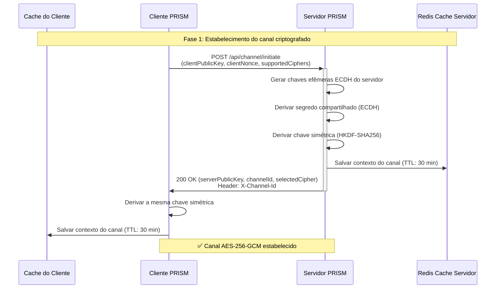

## Fase 1

```mermaid
sequenceDiagram
    participant ClientCache as Cache do Cliente 
    participant PrismClient as Cliente PRISM 
    participant PrismServer as Servidor PRISM 
    participant Redis as Redis Cache Servidor 

    Note over ClientCache,Redis: Fase 1: Estabelecimento do canal criptografado
    PrismClient->>+PrismServer: POST /api/channel/initiate<br/>(clientPublicKey, clientNonce, supportedCiphers)
    PrismServer->>PrismServer: Gerar chaves efêmeras ECDH do servidor
    PrismServer->>PrismServer: Derivar segredo compartilhado (ECDH)
    PrismServer->>PrismServer: Derivar chave simétrica (HKDF-SHA256)
    PrismServer->>Redis: Salvar contexto do canal (TTL: 30 min)
    PrismServer->>-PrismClient: 200 OK (serverPublicKey, channelId, selectedCipher)<br/>Header: X-Channel-Id
    PrismClient->>PrismClient: Derivar a mesma chave simétrica
    PrismClient->>ClientCache: Salvar contexto do canal (TTL: 30 min)
    Note over PrismClient,PrismServer: ✅ Canal AES-256-GCM estabelecido
```

