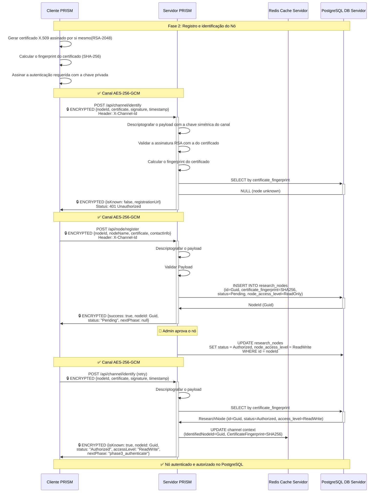

## Fase 2

```mermaid
sequenceDiagram
    participant PrismClient as Cliente PRISM 
    participant PrismServer as Servidor PRISM 
    participant Redis as Redis Cache Servidor 
    participant PG as PostgreSQL DB Servidor 

    Note over PrismClient,PG: Fase 2: Registro e identificação do Nó

    PrismClient->>PrismClient: Gerar certificado X.509 assinado por si mesmo(RSA-2048)
    PrismClient->>PrismClient: Calcular o fingerprint do certificado (SHA-256)
    PrismClient->>PrismClient: Assinar a autenticação requerida com a chave privada
    
    Note over PrismClient,PrismServer: ✅ Canal AES-256-GCM
    PrismClient->>+PrismServer: POST /api/channel/identify<br/>🔒 ENCRYPTED {nodeId, certificate, signature, timestamp}<br/>Header: X-Channel-Id
    PrismServer->>PrismServer: Descriptografar o payload com a chave simétrica do canal
    PrismServer->>PrismServer: Validar a assinatura RSA com a do certificado
    PrismServer->>PrismServer: Calcular o fingerprint do certificado
    PrismServer->>+PG: SELECT by certificate_fingerprint
    PG->-PrismServer: NULL (node unknown)
    PrismServer->>-PrismClient: 🔒 ENCRYPTED {isKnown: false, registrationUrl}<br/>Status: 401 Unauthorized
    
    Note over PrismClient,PrismServer: ✅ Canal AES-256-GCM
    PrismClient->>+PrismServer: POST /api/node/register<br/>🔒 ENCRYPTED {nodeId, nodeName, certificate,    contactInfo}<br/>Header: X-Channel-Id
    PrismServer->>PrismServer: Descriptografar o payload
    PrismServer->>PrismServer: Validar Payload
    PrismServer->>+PG: INSERT INTO research_nodes<br/>(id=Guid, certificate_fingerprint=SHA256,<br/> status=Pending, node_access_level=ReadOnly)
    PG->>-PrismServer: NodeId (Guid)

    PrismServer->>-PrismClient: 🔒 ENCRYPTED {success: true, nodeId: Guid,<br/>status: "Pending", nextPhase: null}

    Note over PrismServer: 👤 Admin aprova o nó
    PrismServer->>PG: UPDATE research_nodes<br/>SET status = Authorized, node_access_level = ReadWrite<br/>WHERE id = nodeId

    Note over PrismClient,PrismServer: ✅ Canal AES-256-GCM
    PrismClient->>+PrismServer: POST /api/channel/identify (retry)<br/>🔒 ENCRYPTED {nodeId, certificate, signature, timestamp}
    PrismServer->>PrismServer: Descriptografar o payload
    PrismServer->>+PG: SELECT by certificate_fingerprint
    PG->>-PrismServer: ResearchNode (id=Guid, status=Authorized, access_level=ReadWrite)
    PrismServer->>Redis: UPDATE channel context<br/>(IdentifiedNodeId=Guid, CertificateFingerprint=SHA256)
    PrismServer->>-PrismClient: 🔒 ENCRYPTED {isKnown: true, nodeId: Guid,<br/>status: "Authorized", accessLevel: "ReadWrite",<br/>nextPhase: "phase3_authenticate"}

    Note over PrismClient,PG: ✅ Nó autenticado e autorizado no PostgreSQL

```