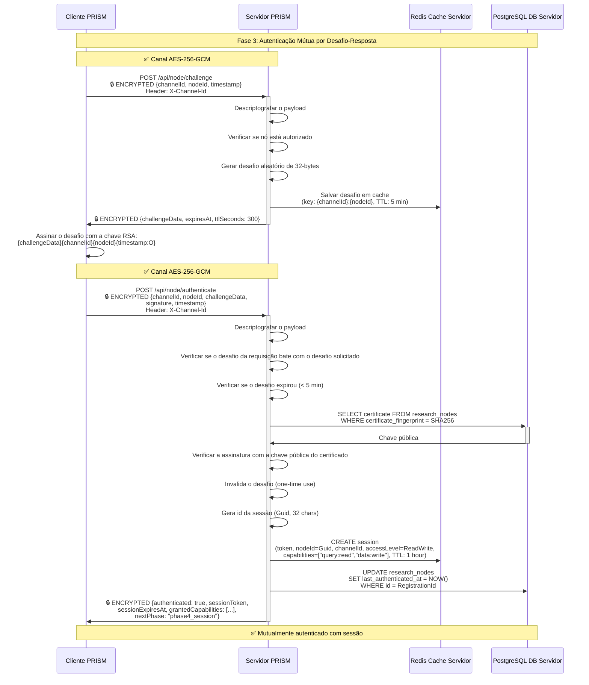

## Fase 3

```mermaid
sequenceDiagram
    participant PrismClient as Cliente PRISM 
    participant PrismServer as Servidor PRISM 
    participant Redis as Redis Cache Servidor 
    participant PG as PostgreSQL DB Servidor 

    Note over PrismClient,PG: Fase 3: Autenticação Mútua por Desafio-Resposta
    Note over PrismClient,PrismServer: ✅ Canal AES-256-GCM
    PrismClient->>+PrismServer: POST /api/node/challenge<br/>🔒 ENCRYPTED {channelId, nodeId, timestamp}<br/>Header: X-Channel-Id
    PrismServer->>PrismServer: Descriptografar o payload
    PrismServer->>PrismServer: Verificar se nó está autorizado
    PrismServer->>PrismServer: Gerar desafio aleatório de 32-bytes
    PrismServer->>Redis: Salvar desafio em cache<br/>(key: {channelId}:{nodeId}, TTL: 5 min)
    PrismServer->>-PrismClient: 🔒 ENCRYPTED {challengeData, expiresAt, ttlSeconds: 300}

    PrismClient->>PrismClient: Assinar o desafio com a chave RSA:<br/>{challengeData}{channelId}{nodeId}{timestamp:O}
    
    Note over PrismClient,PrismServer: ✅ Canal AES-256-GCM
    PrismClient->>+PrismServer: POST /api/node/authenticate<br/>🔒 ENCRYPTED {channelId, nodeId, challengeData,<br/>signature, timestamp}<br/>Header: X-Channel-Id
    PrismServer->>PrismServer: Descriptografar o payload
    PrismServer->>PrismServer: Verificar se o desafio da requisição bate com o desafio solicitado
    PrismServer->>PrismServer: Verificar se o desafio expirou (< 5 min)
    PrismServer->>+PG: SELECT certificate FROM research_nodes<br/>WHERE certificate_fingerprint = SHA256
    PG->>-PrismServer: Chave pública
    PrismServer->>PrismServer: Verificar a assinatura com a chave pública do certificado
    PrismServer->>PrismServer: Invalida o desafio (one-time use)
    PrismServer->>PrismServer: Gera id da sessão (Guid, 32 chars)
    PrismServer->>Redis: CREATE session<br/>(token, nodeId=Guid, channelId, accessLevel=ReadWrite,<br/>capabilities=["query:read","data:write"], TTL: 1 hour)
    PrismServer->>PG: UPDATE research_nodes<br/>SET last_authenticated_at = NOW()<br/>WHERE id = RegistrationId
    PrismServer->>-PrismClient: 🔒 ENCRYPTED {authenticated: true, sessionToken,<br/>sessionExpiresAt, grantedCapabilities: [...],<br/>nextPhase: "phase4_session"}
    Note over PrismClient,PG: ✅ Mutualmente autenticado com sessão
```
