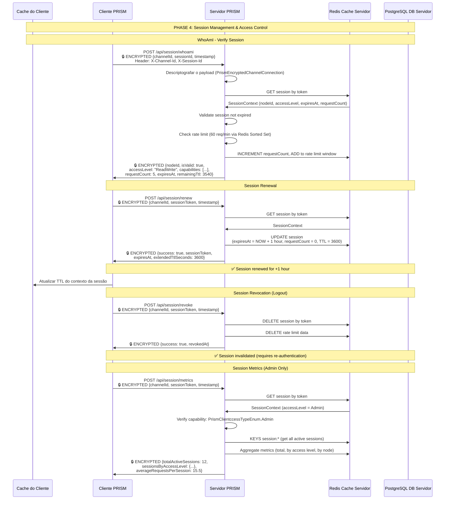

## Fase 4

```mermaid
sequenceDiagram
    participant ClientCache as Cache do Cliente 
    participant PrismClient as Cliente PRISM 
    participant PrismServer as Servidor PRISM 
    participant Redis as Redis Cache Servidor 
    participant PG as PostgreSQL DB Servidor 
    Note over ClientCache,PG: PHASE 4: Session Management & Access Control

    Note over ClientCache,PG: WhoAmI - Verify Session
    PrismClient->>PrismServer: POST /api/session/whoami<br/>🔒 ENCRYPTED {channelId, sessionId, timestamp}<br/>Header: X-Channel-Id, X-Session-Id
    PrismServer->>PrismServer: Descriptografar o payload (PrismEncryptedChannelConnection)
    PrismServer->>Redis: GET session by token
    Redis->>PrismServer: SessionContext (nodeId, accessLevel, expiresAt, requestCount)
    PrismServer->>PrismServer: Validate session not expired
    PrismServer->>PrismServer: Check rate limit (60 req/min via Redis Sorted Set)
    PrismServer->>Redis: INCREMENT requestCount, ADD to rate limit window
    PrismServer->>PrismClient: 🔒 ENCRYPTED {nodeId, isValid: true,<br/>accessLevel: "ReadWrite", capabilities: [...],<br/>requestCount: 5, expiresAt, remainingTtl: 3540}

    Note over PrismClient,PG: Session Renewal
    PrismClient->>PrismServer: POST /api/session/renew<br/>🔒 ENCRYPTED {channelId, sessionToken, timestamp}
    PrismServer->>Redis: GET session by token
    Redis->>PrismServer: SessionContext
    PrismServer->>Redis: UPDATE session<br/>(expiresAt = NOW + 1 hour, requestCount = 0, TTL = 3600)
    PrismServer->>PrismClient: 🔒 ENCRYPTED {success: true, sessionToken,<br/>expiresAt, extendedTtlSeconds: 3600}
    Note over PrismClient,PG: ✅ Session renewed for +1 hour

    PrismClient->>ClientCache: Atualizar TTL do contexto da sessão


    Note over PrismClient,PG: Session Revocation (Logout)
    PrismClient->>PrismServer: POST /api/session/revoke<br/>🔒 ENCRYPTED {channelId, sessionToken, timestamp}
    PrismServer->>Redis: DELETE session by token
    PrismServer->>Redis: DELETE rate limit data
    PrismServer->>PrismClient: 🔒 ENCRYPTED {success: true, revokedAt}
    Note over PrismClient,PG: ✅ Session invalidated (requires re-authentication)

    Note over PrismClient,PG: Session Metrics (Admin Only)
    PrismClient->>PrismServer: POST /api/session/metrics<br/>🔒 ENCRYPTED {channelId, sessionToken, timestamp}
    PrismServer->>Redis: GET session by token
    Redis->>PrismServer: SessionContext (accessLevel = Admin)
    PrismServer->>PrismServer: Verify capability: PrismClientccessTypeEnum.Admin
    PrismServer->>Redis: KEYS session:* (get all active sessions)
    PrismServer->>Redis: Aggregate metrics (total, by access level, by node)
    PrismServer->>PrismClient: 🔒 ENCRYPTED {totalActiveSessions: 12,<br/>sessionsByAccessLevel: {...},<br/>averageRequestsPerSession: 15.5}

```