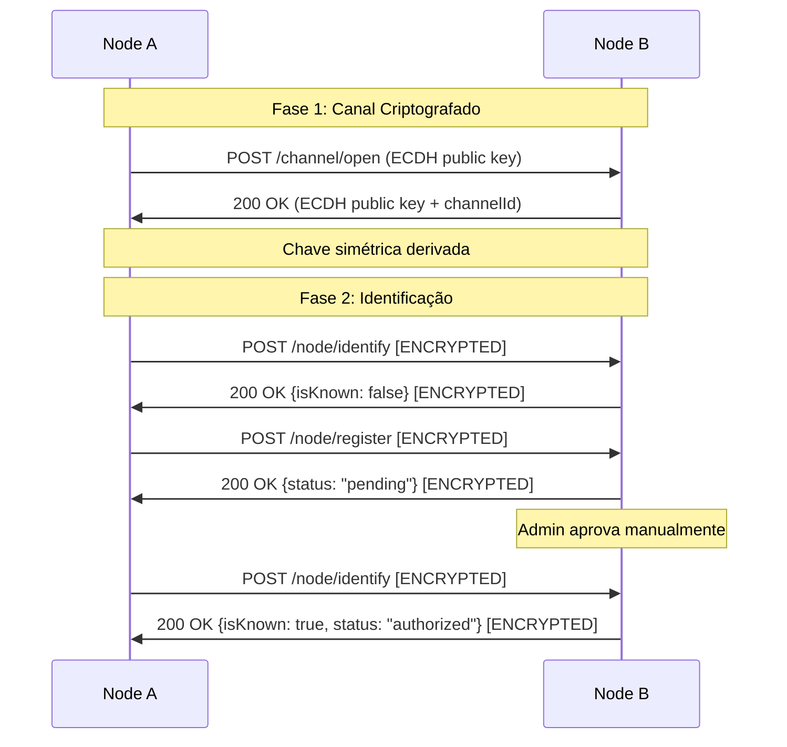

```mermaid
sequenceDiagram
    participant A as Node A
    participant B as Node B
    
    Note over A,B: Fase 1: Canal Criptografado
    A->>B: POST /channel/open (ECDH public key)
    B->>A: 200 OK (ECDH public key + channelId)
    Note over A,B: Chave simétrica derivada
    
    Note over A,B: Fase 2: Identificação
    A->>B: POST /node/identify [ENCRYPTED]
    B->>A: 200 OK {isKnown: false} [ENCRYPTED]
    
    A->>B: POST /node/register [ENCRYPTED]
    B->>A: 200 OK {status: "pending"} [ENCRYPTED]
    
    Note over B: Admin aprova manualmente
    
    A->>B: POST /node/identify [ENCRYPTED]
    B->>A: 200 OK {isKnown: true, status: "authorized"} [ENCRYPTED]
```