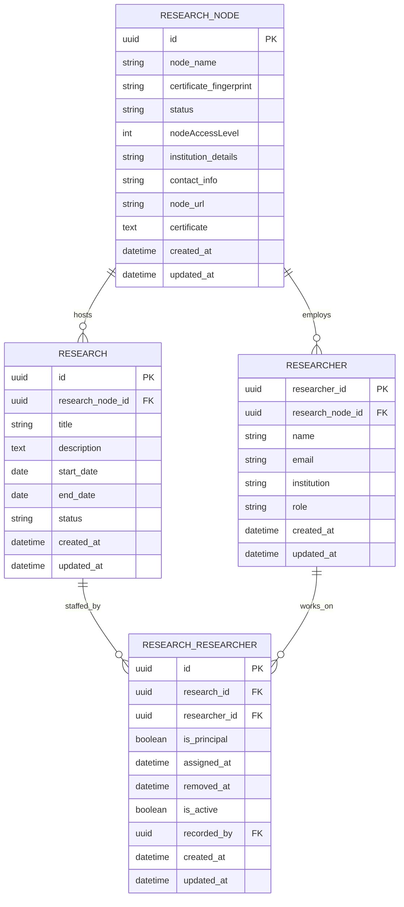
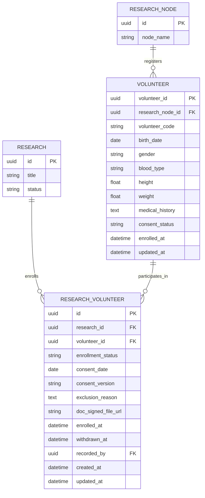
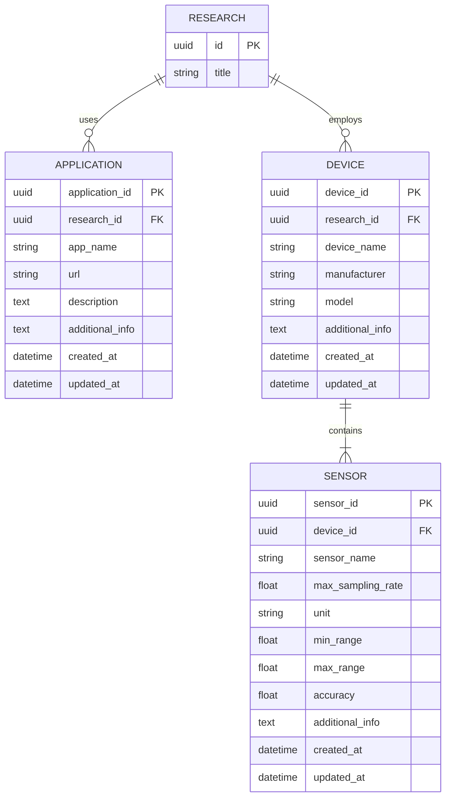
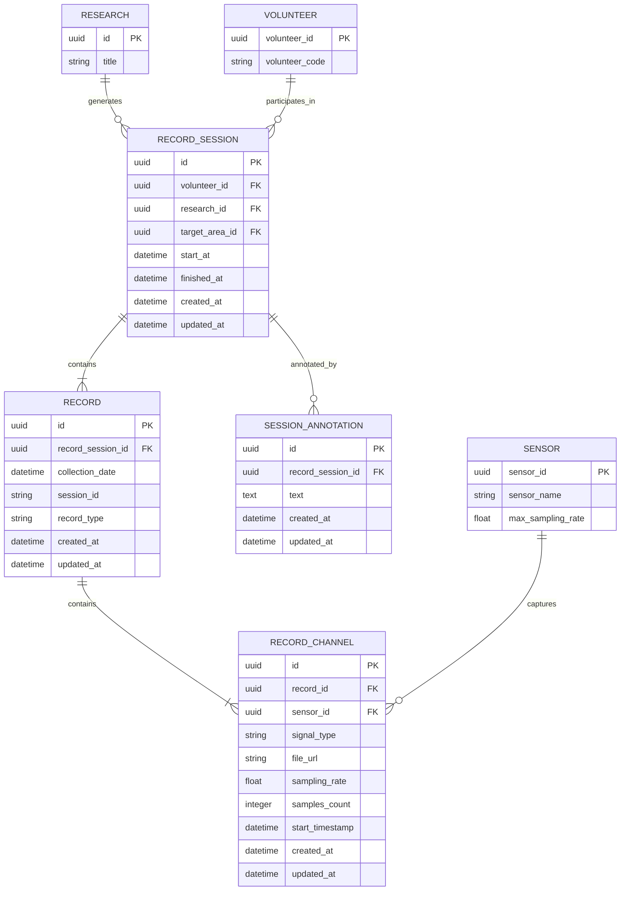
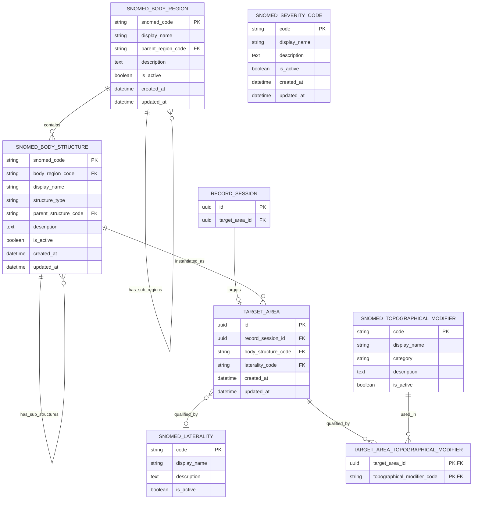
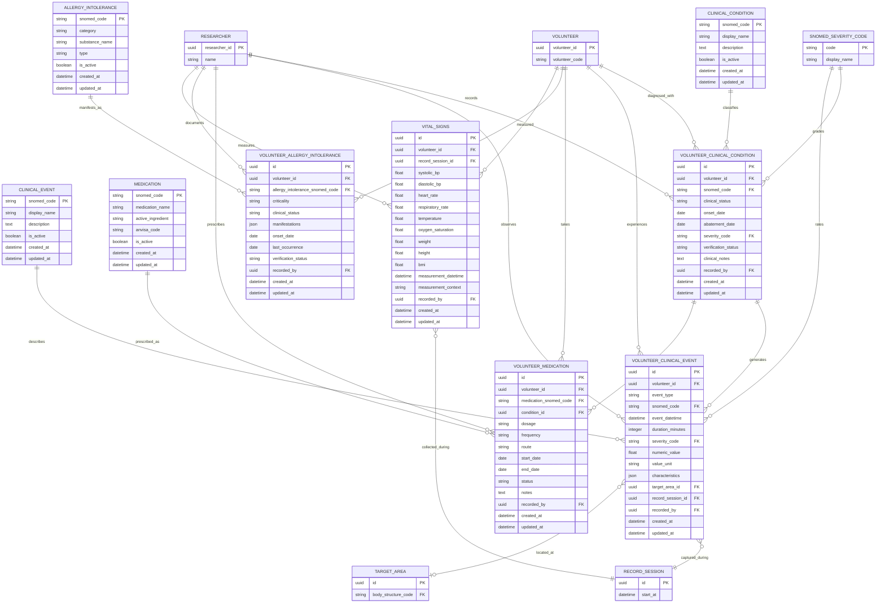
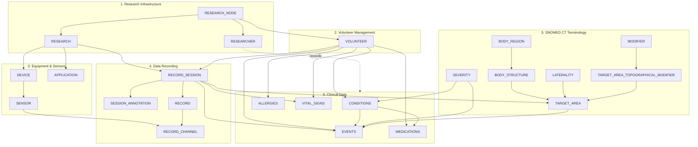

# Database Entity-Relationship Diagrams (Modular)

This document breaks the complete ER diagram into smaller, domain-focused sub-diagrams for easier comprehension. Each diagram highlights a specific bounded context with explicit boundary markers for entities from other domains.

---

## 1. Research Infrastructure Domain

Core organizational structure: nodes, research projects, and researchers.

**Key Points:**
- `RESEARCH_NODE` is the root entity representing a federated institution
- Each node hosts multiple `RESEARCH` projects
- `RESEARCH_RESEARCHER` is a many-to-many join with audit trail (`recorded_by`, `assigned_at`)

---

## 2. Volunteer Management Domain

Volunteer enrollment and participation tracking.

**Key Points:**
- Volunteers belong to a single `RESEARCH_NODE` (data sovereignty)
- `RESEARCH_VOLUNTEER` tracks consent and enrollment with audit fields
- `volunteer_code` provides anonymization (no PII in cross-node queries)

---

## 3. Equipment & Sensors Domain

Devices and sensors used in research data acquisition.

**Key Points:**
- `DEVICE` and `APPLICATION` are scoped per research project
- `SENSOR` specifications (sampling rate, range, accuracy) enable data validation
- Metadata stored in `additional_info` JSONB columns

---

## 4. Data Recording Domain

Session-based biosignal acquisition workflow.

**Key Points:**
- `RECORD_SESSION` groups all recordings from a single collection event and holds a nullable FK to `TARGET_AREA` (the anatomical target for the entire session — Phase 20)
- `SESSION_ANNOTATION` replaces the removed `RECORD_CHANNEL.annotations` JSONB field; annotations are persisted at session level via `POST /api/ClinicalSession/{sessionId}/annotations/New`
- `RECORD_CHANNEL` stores actual biosignal data (`file_url` points to binary storage)
- `RECORD.notes` and `RECORD_CHANNEL.annotations` were removed in Phase 20

---

## 5. SNOMED CT Anatomical Terminology Domain

Self-referencing hierarchies for body regions and structures, plus the session-level target area.

**Key Points:**
- Self-referencing hierarchies enable anatomical taxonomy (e.g., Upper Limb → Arm → Forearm)
- `TARGET_AREA` post-coordinates SNOMED concepts: structure + optional laterality + N topographical modifiers
- **Phase 20**: `TARGET_AREA` is now owned by `RECORD_SESSION` (1:0..1), not `RECORD_CHANNEL`. Topographical modifiers moved from a scalar FK to the explicit N:M join table `TARGET_AREA_TOPOGRAPHICAL_MODIFIER`
- `SNOMED_SEVERITY_CODE` shared across clinical conditions and events

---

## 6. Clinical Data Domain

Volunteer health records: conditions, events, medications, allergies, vitals.

**Key Points:**
- Four reference tables (`CLINICAL_CONDITION`, `CLINICAL_EVENT`, `MEDICATION`, `ALLERGY_INTOLERANCE`) use SNOMED CT codes as PKs
- Volunteer-specific tables link reference data with temporal and contextual information
- `recorded_by` FK on all clinical data provides audit trail
- `VITAL_SIGNS` captures standard physiological measurements

---

## Domain Interconnections Overview

High-level view showing how domains connect:

---

## Cross-Reference Table

| Domain | Tables | Primary Relationships |
|--------|--------|----------------------|
| **1. Research Infrastructure** | 4 | Root of all data ownership |
| **2. Volunteer Management** | 2 | Connects participants to research |
| **3. Equipment & Sensors** | 3 | Defines acquisition capabilities |
| **4. Data Recording** | 4 | Captures biosignal data (`+SESSION_ANNOTATION`) |
| **5. SNOMED CT Terminology** | 7 | Standardized anatomical vocabulary (`+TARGET_AREA_TOPOGRAPHICAL_MODIFIER`) |
| **6. Clinical Data** | 9 | Health records and observations |
| **Total** | **29** | 28 main + 1 explicit join table |

> **Phase 20 delta**: Domain 4 gained `SESSION_ANNOTATION`; Domain 5 gained `TARGET_AREA_TOPOGRAPHICAL_MODIFIER` join table and re-parented `TARGET_AREA` from channel to session. Domains 1-3 and 6 unchanged.

---

## Navigation

- **Complete ER Diagram**: [er-diagram.md](er-diagram.md)
- **Implementation Notes**: See original file for repository specializations
- **Database Commands**: See original file for migration instructions
