# Database Entity-Relationship Diagram

**Implementation Status**: ✅ **COMPLETED** (2025-10-07)

All 16 entities have been implemented with:
- Domain entities in `Bioteca.Prism.Domain/Entities/`
- EF Core configurations in `Bioteca.Prism.Data/Persistence/Configurations/`
- Repository pattern (base + 14 specialized repositories)
- PostgreSQL migration `AddResearchDataTables`
- Dependency injection registration in `Program.cs`

## Key Implementation Features

- **Generic Repository Pattern**: Base `IRepository<TEntity, TKey>` with specialized implementations
- **PostgreSQL-Specific**: JSONB columns for metadata and annotations
- **SNOMED CT Integration**: Self-referencing hierarchies for medical terminology
- **Composite Primary Keys**: Many-to-many join tables
- **Navigation Properties**: Full EF Core relationship mapping
- **Snake Case Naming**: PostgreSQL column naming convention

## ER Diagram

```mermaid
erDiagram
    %% Entidades Principais
    RESEARCH_NODE {
        uuid id PK
        string node_name
        string certificate
        string certificate_fingerprint
        string status
        int nodeAccessLevel
        string institution_details
        string contact_info
        string node_url
        text certificate
        string status
        datetime created_at
        datetime updated_at
    }
    
    RESEARCH {
        uuid id PK
        uuid research_node_id FK
        string title
        text description
        date start_date
        date end_date
        string status
        datetime created_at
        datetime updated_at
    }
    
    VOLUNTEER {
        uuid volunteer_id PK
        uuid research_node_id FK
        string volunteer_code
        date birth_date
        string gender
        string blood_type
        float height
        float weight
        text medical_history
        string consent_status
        datetime enrolled_at
        datetime updated_at
    }
    
    RESEARCHER {
        uuid researcher_id PK
        uuid research_node_id FK
        string name
        string email
        string institution
        string role
        datetime created_at
        datetime updated_at
    }
    
    APPLICATION {
        uuid application_id PK
        uuid research_id FK
        string app_name
        string url
        text description
        text additional_info
        datetime created_at
        datetime updated_at
    }
    
    DEVICE {
        uuid device_id PK
        uuid research_id FK
        string device_name
        string manufacturer
        string model
        text additional_info
        datetime created_at
        datetime updated_at
    }
    
    SENSOR {
        uuid sensor_id PK
        uuid device_id FK
        string sensor_name
        float max_sampling_rate
        string unit
        float min_range
        float max_range
        float accuracy
        text additional_info
        datetime created_at
        datetime updated_at
    }

    RECORD_SESSION{
        uuid id PK
        uuid research_id FK
        uuid volunteer_id FK
        text clinical_context
        datetime start_at
        datetime finished_at
        datetime created_at
        datetime updated_at
    }
    
    RECORD {
        uuid id PK
        uuid record_session_id FK
        datetime collection_date
        string session_id
        string record_type
        text notes
        datetime created_at
        datetime updated_at
    }
    
    RECORD_CHANNEL {
        uuid id PK
        uuid record_id FK
        uuid sensor_id FK
        string signal_type
        string file_url
        float sampling_rate
        integer samples_count
        datetime start_timestamp
        json annotations
        datetime created_at
    }

    TARGET_AREA{
        uuid id PK
        uuid record_channel_id FK
        string body_structure_code FK
        string laterality_code FK
        string topographical_modifier_code FK
        text notes
        datetime created_at
        datetime updated_at
    }

    SNOMED_LATERALITY {
        string code PK
        string display_name
        text description
        boolean is_active              
    }

    SNOMED_TOPOGRAPHICAL_MODIFIER {
        string code PK
        string display_name
        string category                
        text description
        boolean is_active              
    }

    SNOMED_BODY_REGION {
        string snomed_code PK          
        string display_name
        string parent_region_code FK  
        text description              
        boolean is_active             
        datetime created_at           
        datetime updated_at           
    }
    
    SNOMED_BODY_STRUCTURE {
        string snomed_code PK
        string body_region_code FK     
        string display_name
        string structure_type
        string parent_structure_code FK 
        text description
        boolean is_active              
        datetime created_at            
        datetime updated_at            
    }
    
    
    %% Tabelas Associativas (Muitos para Muitos)

    
    RESEARCH_VOLUNTEER {
        uuid research_id FK
        uuid volunteer_id FK
        string enrollment_status
        date consent_date
        string consent_version
        text exclusion_reason
        datetime enrolled_at
        datetime withdrawn_at
    }
    
    RESEARCH_RESEARCHER {
        uuid research_id FK
        uuid researcher_id FK
        boolean is_principal
        datetime assigned_at
        datetime removed_at
    }
    
    %% Relacionamentos
    RESEARCH_NODE  ||--o{ RESEARCH : host
    RESEARCH_NODE  ||--o{ RESEARCHER : Has  
    RESEARCH_NODE  ||--o{ VOLUNTEER : Has   
    RESEARCH ||--o{ RESEARCH_VOLUNTEER : enrolls
    VOLUNTEER ||--o{ RESEARCH_VOLUNTEER : participates_in
    
    RESEARCH ||--o{ RESEARCH_RESEARCHER : has
    RESEARCHER ||--o{ RESEARCH_RESEARCHER : works_on
    
    RESEARCH ||--o{ APPLICATION : uses
    RESEARCH ||--o{ DEVICE : employs
    
    DEVICE ||--|{ SENSOR : contains
    
    RESEARCH ||--o{ RECORD_SESSION : generates
    VOLUNTEER ||--o{ RECORD_SESSION : participates_in
    RESEARCHER ||--o{ RECORD_SESSION : participates_in
    
    RECORD_SESSION ||--|{ RECORD : contains
    RECORD ||--|{ RECORD_CHANNEL : contains
    SENSOR ||--o{ RECORD_CHANNEL : captures

    SNOMED_BODY_REGION ||--o{ SNOMED_BODY_REGION : "has sub-regions"
    SNOMED_BODY_REGION ||--o{ SNOMED_BODY_STRUCTURE : "contains structures"
    SNOMED_BODY_STRUCTURE ||--o{ SNOMED_BODY_STRUCTURE : "has sub-structures"
    SNOMED_BODY_STRUCTURE ||--o{ TARGET_AREA : "instantiated as"
    RECORD_CHANNEL ||--o{ TARGET_AREA : "targets"
    TARGET_AREA }o--o| SNOMED_LATERALITY : "qualified by"
    TARGET_AREA }o--o| SNOMED_TOPOGRAPHICAL_MODIFIER : "modified by"

```



## Implementation Notes

### Repository Specializations

Each repository extends the generic base repository with domain-specific queries:

**Research Repositories**:
- `IResearchRepository`: Query by node ID, status, active research filter
- `IVolunteerRepository`: Query by node ID, volunteer code, age range
- `IResearcherRepository`: Query by node ID, institution, role
- `IApplicationRepository`: Query by research ID, application type
- `IDeviceRepository`: Query by research ID, manufacturer, model
- `ISensorRepository`: Query by device ID, sensor type

**Record Repositories**:
- `IRecordSessionRepository`: Query by research ID, volunteer ID, date range
- `IRecordRepository`: Query by session ID, record type, date range
- `IRecordChannelRepository`: Query by record ID, sensor ID, signal type (includes navigation)
- `ITargetAreaRepository`: Query by channel ID, body structure code (includes SNOMED navigation)

**SNOMED Repositories**:
- `ISnomedLateralityRepository`: Query active laterality codes
- `ISnomedTopographicalModifierRepository`: Query by category, active codes
- `ISnomedBodyRegionRepository`: Query top-level regions, sub-regions, active codes
- `ISnomedBodyStructureRepository`: Query by body region, structure type, parent/sub-structures

### Database Migration

Generated migration: `AddResearchDataTables`

Apply with:
```bash
dotnet ef database update --project Bioteca.Prism.Data --startup-project Bioteca.Prism.InteroperableResearchNode
```

### Testing

Integration tests pending. Manual testing via:
- pgAdmin UI (http://localhost:5050)
- PostgreSQL CLI: `docker exec -it irn-postgres-node-a psql -U prism_user_a -d prism_node_a_registry`