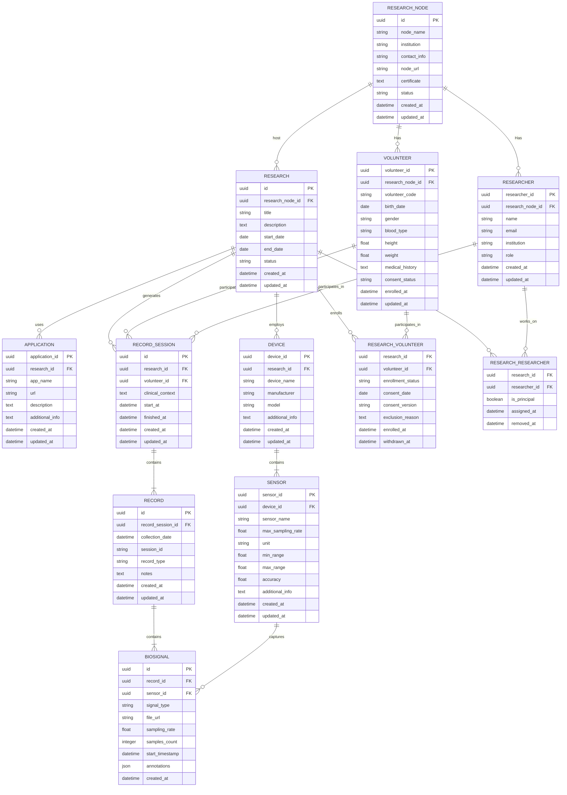

```mermaid
erDiagram
    %% Entidades Principais
    RESEARCH_NODE {
        uuid id PK
        string node_name
        string institution
        string contact_info
        string node_url
        text certificate
        string status
        datetime created_at
        datetime updated_at
    }
    
    RESEARCH {
        uuid id PK
        uuid research_node_id FK
        string title
        text description
        date start_date
        date end_date
        string status
        datetime created_at
        datetime updated_at
    }
    
    VOLUNTEER {
        uuid volunteer_id PK
        uuid research_node_id FK
        string volunteer_code
        date birth_date
        string gender
        string blood_type
        float height
        float weight
        text medical_history
        string consent_status
        datetime enrolled_at
        datetime updated_at
    }
    
    RESEARCHER {
        uuid researcher_id PK
        uuid research_node_id FK
        string name
        string email
        string institution
        string role
        datetime created_at
        datetime updated_at
    }
    
    APPLICATION {
        uuid application_id PK
        uuid research_id FK
        string app_name
        string url
        text description
        text additional_info
        datetime created_at
        datetime updated_at
    }
    
    DEVICE {
        uuid device_id PK
        uuid research_id FK
        string device_name
        string manufacturer
        string model
        text additional_info
        datetime created_at
        datetime updated_at
    }
    
    SENSOR {
        uuid sensor_id PK
        uuid device_id FK
        string sensor_name
        float max_sampling_rate
        string unit
        float min_range
        float max_range
        float accuracy
        text additional_info
        datetime created_at
        datetime updated_at
    }

    RECORD_SESSION{
        uuid id PK
        uuid research_id FK
        uuid volunteer_id FK
        text clinical_context
        datetime start_at
        datetime finished_at
        datetime created_at
        datetime updated_at
    }
    
    RECORD {
        uuid id PK
        uuid record_session_id FK
        datetime collection_date
        string session_id
        string record_type
        text notes
        datetime created_at
        datetime updated_at
    }
    
    BIOSIGNAL {
        uuid id PK
        uuid record_id FK
        uuid sensor_id FK
        string signal_type
        string file_url
        float sampling_rate
        integer samples_count
        datetime start_timestamp
        json annotations
        datetime created_at
    }
    
    %% Tabelas Associativas (Muitos para Muitos)

    
    RESEARCH_VOLUNTEER {
        uuid research_id FK
        uuid volunteer_id FK
        string enrollment_status
        date consent_date
        string consent_version
        text exclusion_reason
        datetime enrolled_at
        datetime withdrawn_at
    }
    
    RESEARCH_RESEARCHER {
        uuid research_id FK
        uuid researcher_id FK
        boolean is_principal
        datetime assigned_at
        datetime removed_at
    }
    
    %% Relacionamentos
    RESEARCH_NODE  ||--o{ RESEARCH : host
    RESEARCH_NODE  ||--o{ RESEARCHER : Has  
    RESEARCH_NODE  ||--o{ VOLUNTEER : Has   
    RESEARCH ||--o{ RESEARCH_VOLUNTEER : enrolls
    VOLUNTEER ||--o{ RESEARCH_VOLUNTEER : participates_in
    
    RESEARCH ||--o{ RESEARCH_RESEARCHER : has
    RESEARCHER ||--o{ RESEARCH_RESEARCHER : works_on
    
    RESEARCH ||--o{ APPLICATION : uses
    RESEARCH ||--o{ DEVICE : employs
    
    DEVICE ||--|{ SENSOR : contains
    
    RESEARCH ||--o{ RECORD_SESSION : generates
    VOLUNTEER ||--o{ RECORD_SESSION : participates_in
    RESEARCHER ||--o{ RECORD_SESSION : participates_in
    
    RECORD_SESSION ||--|{ RECORD : contains
    RECORD ||--|{ BIOSIGNAL : contains
    SENSOR ||--o{ BIOSIGNAL : captures
```