# Database Entity-Relationship Diagram

**Implementation Status**: ✅ **COMPLETED** — last updated Phase 20 (2026-03-01)

All entities have been implemented with:
- Domain entities in `Bioteca.Prism.Domain/Entities/`
- EF Core configurations in `Bioteca.Prism.Data/Configurations/`
- Repository pattern (base + specialized repositories)
- PostgreSQL migrations: `AddResearchDataTables`, `EntityMappingCorrections` (20260301163557)
- Dependency injection registration in `Program.cs`

**Phase 20 changes (EntityMappingCorrections)**:
- `TARGET_AREA` re-parented from `RECORD_CHANNEL` → `RECORD_SESSION` (1:0..1 relationship)
- `TARGET_AREA` topographical modifiers are now N:M via explicit join `TARGET_AREA_TOPOGRAPHICAL_MODIFIER`
- `RECORD_SESSION.clinical_context` (text) replaced by `target_area_id` FK
- `RECORD.notes` removed
- `RECORD_CHANNEL.annotations` (JSONB) removed — session annotations use `SESSION_ANNOTATION`
- `TARGET_AREA.topographical_modifier_code` scalar FK removed
- `TARGET_AREA.notes` removed

## Key Implementation Features

- **Generic Repository Pattern**: Base `IRepository<TEntity, TKey>` with specialized implementations
- **SNOMED CT Integration**: Self-referencing hierarchies for medical terminology
- **Composite Primary Keys**: Many-to-many join tables (`target_area_topographical_modifier`)
- **Navigation Properties**: Full EF Core relationship mapping
- **Snake Case Naming**: PostgreSQL column naming convention

## ER Diagram

```mermaid
erDiagram
    %% Entidades Principais
    RESEARCH_NODE {
        uuid id PK
        string node_name
        string certificate
        string certificate_fingerprint
        string status
        int nodeAccessLevel
        string institution_details
        string contact_info
        string node_url
        text certificate
        string status
        datetime created_at
        datetime updated_at
    }
    
    RESEARCH {
        uuid id PK
        uuid research_node_id FK
        string title
        text description
        date start_date
        date end_date
        string status
        datetime created_at
        datetime updated_at
    }
    
    VOLUNTEER {
        uuid volunteer_id PK
        uuid research_node_id FK
        string volunteer_code
        date birth_date
        string gender
        string blood_type
        float height
        float weight
        text medical_history
        string consent_status
        datetime enrolled_at
        datetime updated_at
    }
    
    RESEARCHER {
        uuid researcher_id PK
        uuid research_node_id FK
        string name
        string email
        string institution
        string role
        datetime created_at
        datetime updated_at
    }
    
    APPLICATION {
        uuid application_id PK
        uuid research_id FK
        string app_name
        string url
        text description
        text additional_info
        datetime created_at
        datetime updated_at
    }
    
    DEVICE {
        uuid device_id PK
        uuid research_id FK
        string device_name
        string manufacturer
        string model
        text additional_info
        datetime created_at
        datetime updated_at
    }
    
    SENSOR {
        uuid sensor_id PK
        uuid device_id FK
        string sensor_name
        float max_sampling_rate
        string unit
        float min_range
        float max_range
        float accuracy
        text additional_info
        datetime created_at
        datetime updated_at
    }

    RECORD_SESSION{
        uuid id PK
        uuid volunteer_id FK
        uuid research_id FK
        uuid target_area_id FK
        datetime start_at
        datetime finished_at
        datetime created_at
        datetime updated_at
    }

    SESSION_ANNOTATION {
        uuid id PK
        uuid record_session_id FK
        text text
        datetime created_at
        datetime updated_at
    }

    RECORD {
        uuid id PK
        uuid record_session_id FK
        datetime collection_date
        string session_id
        string record_type
        datetime created_at
        datetime updated_at
    }

    RECORD_CHANNEL {
        uuid id PK
        uuid record_id FK
        uuid sensor_id FK
        string signal_type
        string file_url
        float sampling_rate
        integer samples_count
        datetime start_timestamp
        datetime created_at
        datetime updated_at
    }

    TARGET_AREA {
        uuid id PK
        uuid record_session_id FK
        string body_structure_code FK
        string laterality_code FK
        datetime created_at
        datetime updated_at
    }

    TARGET_AREA_TOPOGRAPHICAL_MODIFIER {
        uuid target_area_id PK,FK
        string topographical_modifier_code PK,FK
    }

    SNOMED_LATERALITY {
        string code PK
        string display_name
        text description
        boolean is_active              
    }

    SNOMED_TOPOGRAPHICAL_MODIFIER {
        string code PK
        string display_name
        string category                
        text description
        boolean is_active              
    }

    SNOMED_BODY_REGION {
        string snomed_code PK          
        string display_name
        string parent_region_code FK  
        text description              
        boolean is_active             
        datetime created_at           
        datetime updated_at           
    }
    
    SNOMED_BODY_STRUCTURE {
        string snomed_code PK
        string body_region_code FK     
        string display_name
        string structure_type
        string parent_structure_code FK 
        text description
        boolean is_active              
        datetime created_at            
        datetime updated_at            
    }

    SNOMED_SEVERITY_CODE{
        string code PK
        string display_name 
        text description
        boolean is_active 
        datetime created_at
        datetime updated_at       
    }


    CLINICAL_CONDITION {
        string snomed_code PK        
        string display_name
        text description              
        boolean is_active             
        datetime created_at           
        datetime updated_at      

    }

    CLINICAL_EVENT {
        string snomed_code PK        
        string display_name
        text description              
        boolean is_active             
        datetime created_at           
        datetime updated_at      
    }

    MEDICATION {
        string snomed_code PK        
        string medication_name       
        string active_ingredient     
        string anvisa_code 
        boolean is_active          
        datetime created_at
        datetime updated_at
    }

    ALLERGY_INTOLERANCE {
        string snomed_code PK
        string category            
        string substance_name
        string type
        boolean is_active                  
        datetime created_at
        datetime updated_at
    }

   
    
    %% Tabelas Associativas (Muitos para Muitos)

    
    RESEARCH_VOLUNTEER {
        uuid id PK
        uuid research_id FK
        uuid volunteer_id FK

        string enrollment_status
        date consent_date
        string consent_version
        text exclusion_reason
        string doc_signed_file_url

        datetime enrolled_at
        datetime withdrawn_at
        uuid recorded_by FK         
        datetime created_at
        datetime updated_at
    }
    
    RESEARCH_RESEARCHER {
        uuid id PK
        uuid research_id FK
        uuid researcher_id FK
        
        boolean is_principal
        datetime assigned_at
        datetime removed_at
        
        boolean is_active 
        uuid recorded_by FK         
        datetime created_at
        datetime updated_at
    }

    VITAL_SIGNS {
        uuid id PK
        uuid volunteer_id FK
        uuid record_session_id FK
    
        float systolic_bp          
        float diastolic_bp         
        float heart_rate           
        float respiratory_rate     
        float temperature          
        float oxygen_saturation    
        float weight              
        float height             
        float bmi                 
        
        datetime measurement_datetime
        string measurement_context  

        uuid recorded_by FK        
        datetime created_at
        datetime updated_at
    }


    VOLUNTEER_ALLERGY_INTOLERANCE{
        uuid id PK
        uuid volunteer_id FK
        string allergy_intolerance_snomed_code FK

        string criticality        
        string clinical_status    
        json manifestations       
        date onset_date
        date last_occurrence

        string verification_status 

        uuid recorded_by FK        
        datetime created_at
        datetime updated_at
    
    }

    VOLUNTEER_MEDICATION {

        uuid id PK
        uuid volunteer_id FK
        string medication_snomed_code  FK
        uuid condition_id FK       

        string dosage               
        string frequency           
        string route                
        date start_date
        date end_date              
        string status              
        text notes                 

        uuid recorded_by FK        

        datetime created_at
        datetime updated_at

    }

    VOLUNTEER_CLINICAL_EVENT {
        uuid id PK
        uuid volunteer_id FK 
        string event_type            
        string snomed_code FK        
        datetime event_datetime      
        integer duration_minutes     
        string severity_code FK 
        float numeric_value         
        string value_unit           
        json characteristics        
        uuid target_area_id FK      
        uuid record_session_id FK   
        uuid recorded_by FK         
        
        datetime created_at
        datetime updated_at
    }

    VOLUNTEER_CLINICAL_CONDITION{

        uuid id PK
        uuid volunteer_id FK
        string snomed_code FK        

        string clinical_status        

        date onset_date               
        date abatement_date          
        string severity_code FK       
        string verification_status   

        text clinical_notes          

        uuid recorded_by FK          

        datetime created_at
        datetime updated_at
    }
    
    %% Relacionamentos
    RESEARCH_NODE  ||--o{ RESEARCH : host
    RESEARCH_NODE  ||--o{ RESEARCHER : Has  
    RESEARCH_NODE  ||--o{ VOLUNTEER : Has   
    RESEARCH ||--o{ RESEARCH_VOLUNTEER : enrolls
    VOLUNTEER ||--o{ RESEARCH_VOLUNTEER : participates_in
    
    RESEARCH ||--o{ RESEARCH_RESEARCHER : has
    RESEARCHER ||--o{ RESEARCH_RESEARCHER : works_on
    
    RESEARCH ||--o{ APPLICATION : uses
    RESEARCH ||--o{ DEVICE : employs
    
    DEVICE ||--|{ SENSOR : contains
    
    RESEARCH ||--o{ RECORD_SESSION : generates
    VOLUNTEER ||--o{ RECORD_SESSION : participates_in
    RESEARCHER ||--o{ RECORD_SESSION : participates_in
    
    RECORD_SESSION ||--|{ RECORD : contains
    RECORD_SESSION ||--o| TARGET_AREA : "targets"
    RECORD_SESSION ||--o{ SESSION_ANNOTATION : "annotated_by"
    RECORD ||--|{ RECORD_CHANNEL : contains
    SENSOR ||--o{ RECORD_CHANNEL : captures

    SNOMED_BODY_REGION ||--o{ SNOMED_BODY_REGION : "has sub-regions"
    SNOMED_BODY_REGION ||--o{ SNOMED_BODY_STRUCTURE : "contains structures"
    SNOMED_BODY_STRUCTURE ||--o{ SNOMED_BODY_STRUCTURE : "has sub-structures"
    SNOMED_BODY_STRUCTURE ||--o{ TARGET_AREA : "instantiated as"
    TARGET_AREA }o--o| SNOMED_LATERALITY : "qualified by"
    TARGET_AREA ||--o{ TARGET_AREA_TOPOGRAPHICAL_MODIFIER : "qualified_by"
    SNOMED_TOPOGRAPHICAL_MODIFIER ||--o{ TARGET_AREA_TOPOGRAPHICAL_MODIFIER : "used_in"
    
    %% Voluntário e suas condições clínicas
    VOLUNTEER ||--o{ VOLUNTEER_CLINICAL_CONDITION : "diagnosed_with"
    VOLUNTEER ||--o{ VOLUNTEER_CLINICAL_EVENT : "experiences"
    VOLUNTEER ||--o{ VOLUNTEER_MEDICATION : "takes"
    VOLUNTEER ||--o{ VOLUNTEER_ALLERGY_INTOLERANCE : "has"
    VOLUNTEER ||--o{ VITAL_SIGNS : "measured"
    
    %% Condições clínicas e seus relacionamentos
    CLINICAL_CONDITION ||--o{ VOLUNTEER_CLINICAL_CONDITION : "classifies"
    VOLUNTEER_CLINICAL_CONDITION ||--o{ VOLUNTEER_CLINICAL_EVENT : "generates"
    VOLUNTEER_CLINICAL_CONDITION ||--o{ VOLUNTEER_MEDICATION : "treated_by"
    
    %% Eventos clínicos
    CLINICAL_EVENT ||--o{ VOLUNTEER_CLINICAL_EVENT : "describes"
    VOLUNTEER_CLINICAL_EVENT }o--|| RECORD_SESSION : "captured_during"
    VOLUNTEER_CLINICAL_EVENT }o--o| TARGET_AREA : "located_at"
    
    %% Medicações
    MEDICATION ||--o{ VOLUNTEER_MEDICATION : "prescribed_as"
    VOLUNTEER_MEDICATION }o--o| VOLUNTEER_CLINICAL_CONDITION : "treats"
    
    %% Alergias
    ALLERGY_INTOLERANCE ||--o{ VOLUNTEER_ALLERGY_INTOLERANCE : "manifests_as"
    
    %% Sinais Vitais
    VITAL_SIGNS }o--|| RECORD_SESSION : "collected_during"
    VITAL_SIGNS }o--|| RESEARCHER : "measured_by"
    
    %% Severidade
    SNOMED_SEVERITY_CODE ||--o{ VOLUNTEER_CLINICAL_CONDITION : "grades"
    SNOMED_SEVERITY_CODE ||--o{ VOLUNTEER_CLINICAL_EVENT : "rates"
    
    %% Pesquisador registrando dados
    RESEARCHER ||--o{ VOLUNTEER_CLINICAL_CONDITION : "records"
    RESEARCHER ||--o{ VOLUNTEER_CLINICAL_EVENT : "observes"
    RESEARCHER ||--o{ VOLUNTEER_MEDICATION : "prescribes"
    RESEARCHER ||--o{ VOLUNTEER_ALLERGY_INTOLERANCE : "documents"
    RESEARCHER ||--o{ VITAL_SIGNS : "measures"
    
    %% Sessões de registro capturando dados clínicos
    RECORD_SESSION ||--o{ VOLUNTEER_CLINICAL_EVENT : "captures"
    RECORD_SESSION ||--o{ VITAL_SIGNS : "includes"
    
```



## Implementation Notes

### Repository Specializations

Each repository extends the generic base repository with domain-specific queries:

**Research Repositories**:
- `IResearchRepository`: Query by node ID, status, active research filter
- `IVolunteerRepository`: Query by node ID, volunteer code, age range
- `IResearcherRepository`: Query by node ID, institution, role
- `IApplicationRepository`: Query by research ID, application type
- `IDeviceRepository`: Query by research ID, manufacturer, model
- `ISensorRepository`: Query by device ID, sensor type

**Record Repositories**:
- `IRecordSessionRepository`: Query by research ID, volunteer ID, date range
- `IRecordRepository`: Query by session ID, record type, date range
- `IRecordChannelRepository`: Query by record ID, sensor ID, signal type (includes navigation)
- `ITargetAreaRepository`: Query by **session ID** (`GetByRecordSessionIdAsync`), body structure code (includes SNOMED navigation + TopographicalModifiers collection)

**SNOMED Repositories**:
- `ISnomedLateralityRepository`: Query active laterality codes
- `ISnomedTopographicalModifierRepository`: Query by category, active codes
- `ISnomedBodyRegionRepository`: Query top-level regions, sub-regions, active codes
- `ISnomedBodyStructureRepository`: Query by body region, structure type, parent/sub-structures

### Database Migrations

| Migration | Description |
|-----------|-------------|
| `AddResearchDataTables` | Initial clinical data model (28 tables) |
| `EntityMappingCorrections` (20260301163557) | Phase 20: TargetArea re-parented to RecordSession, N:M topographical modifiers join table, removed clinical_context/notes/annotations fields |

Apply with:
```bash
# Node A
dotnet ef database update --project Bioteca.Prism.Data --startup-project Bioteca.Prism.InteroperableResearchNode

# Node B
dotnet ef database update --project Bioteca.Prism.Data --startup-project Bioteca.Prism.InteroperableResearchNode -- --node NodeB
```

### Testing

Integration tests pending. Manual testing via:
- pgAdmin UI (http://localhost:5050)
- PostgreSQL CLI: `docker exec -it irn-postgres-node-a psql -U prism_user_a -d prism_node_a_registry`